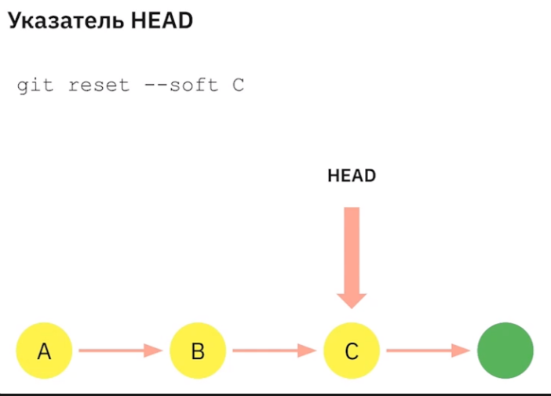
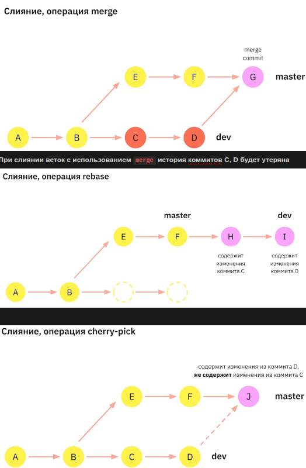

# Работа с изменениями

[Методичка](https://gbcdn.mrgcdn.ru/uploads/asset/4953409/attachment/d426bcfc7614ee4a54fc1c723f5c7a62.pdf)

---

---

Индекс — специальная область в рабочей копии Git-репозитория, в которой хранятся изменения файлов, готовые к коммиту. 

Состояния :

- **not staged**

- **staged**

- **committed**

`git add <file(s)>` - добавление в индекс

`git add .` - добавление в индекс все изм в текущ дир

`git show` - содержимое последнего коммита

`git diff file` - просмотр незакомиченных изм file

`git diff` - просмотр всех не проиндексированных изменений. Если изменений много, выйти из просмотра можно, нажав “q”.

`git diff <хэшКоммита1> <хэшКоммита2> <file>` просм изм между коммитами. первый раньше второго, иначе будут обратные изменения

`git diff <хэшКоммита1> <хэшКоммита2>` - для всех

Можно сравнивать коммиты из разных веток, но в одном репо

`git diff <file1> <file2>` - сравнивает файлы, даже если они вне репо

`git blame` - подробная инф о коммитах(что, кто, когда, …)

Подобное сравнение встроено в разные ide(VSC, …)

---

### Не рекомендуется хранить в Git-репозиториях

- Лог-файлы (логи)


- Файлы, загруженные пользователем

- Служебные файлы сред разработки

- Внешние библиотеки

- Файлы локальной конфигурации

- Файлы операционной системы

- Очень большие файлы

---

## .gitignore

`logs/` - игнорировать папку logs. При таком способе, нельзя исключить отдельные файлы. 

Чтобы была возможность исключить файл:

`logs/*.log`

`!logs/special.log` - исключение из игнорирования special.log. 

---

## Отмена несохранённых изменений

`git restore <file>` отменяет изменения, если не индексирован(не add)

`git restore —staged<file>` отменяет индексирование, если индексирован(add). Если далее выполнить предыдущую команду, изменения будут отменены.

`git reset —hard` - отменяет все изменения для всех отслеживаемых файлов. При этом не удаляет неотслеживаемые файлы.

`git clean -f` - отменяет изменения для неотслеживаемых файлов, в том числе удаляет файлы.

`Вышеперечисленные отмены вернуть нельзя`

`git rm —cached <file>` - удаляет из отслеживания

`git revert <хэшКоммита>` отменяет коммит. При этом git предложит отредактировать сообщение коммита

Несколько коммитов отменяется последовательно 

`git revert —no-commit <хэшКоммита>` - Откат без коммитов

---



---

`git reset —soft <hashCommit>` - сброс коммита. После этого git.status покажет файл в индекс, а коммит исчезнет. Сами изменения останутся

`git reset —mixed <hashCommit>` -  файл не будет в индексе. Это вариант работы команды reset по умолчанию.

`git reset —hard <hashCommit>` -  удалит все последующие коммиты и изменения безвозвратно. Использовать этот вариант нужно ОСТОРОЖНО.

---

`git commit —amend -m ‘New comment’` - изменяет комментарий к последнему коммиту

`git commit —amend —no-edit` - добавляет изменения к последнему коммиту без комментария

---

## Разрешение проблем при слиянии веток

`git reset —merge <hashCommit>` - Отмена слияния и откат до указанного коммита, если слияние уже произошло.

`git megre —abort` - отменяет `git merge`, при возникновении конфликта. Отменит все незакоммиченные изменения, произошедшие в рабочем каталоге в результате неудачного слияния.

---

## Откладывание изменений

https://www.atlassian.com/ru/git/tutorials/saving-changes/git-stash

`git stash` сохраняет изменения репо в текущей ветке. Откладывать изменения можно сколько угодно раз.

`git stash -u` позволяет отложить изменения в неотслеживаемых файлах

`git stash —include-untracked` то-же

`git stash -a(—all)` позволяет отложить изменения в игнорируемых файлах

WIP - Work In Progress

`git stash pop` -  вливает последние отложенные изменения. При этом они удаляются из набора(стека) отложенных изменений

`git stash apply` - то же, что и pop, но не удаляет из набора

Изменения можно откладывать многократно. При этом они хранятся в виде стека.

`git stash list` - выводит список всех отложенных изменений

`git stash drop` - удаляет последнее отложенное изменение

При вытаскивании отл изменений может произойти конфликт. В этом случае git отменит `stash pop.`Нужно закоммитить изменения, и после этого `git stash pop` и вручную разрешить конфликт. При этом изменение не исчезает из списка (`git stash list`). Нужно удалить его вручную `git stash drop`

---

## Команды перемещения изменений

`git merge <new_branche>`

`git rebase <new_brance>`

git rebase -i HEAD~4 интерактивное копирование коммитов из указанного диапазона. Указатель HEAD ветки, из которой выполняется эта команда, устанавливается на вершину отредактированного диапазона

`git cherry-pick <commit1> <commit2> <….> копирует один или несколько коммитов на место, где сейчас HEAD`



`git tag v1 <commit>` создаёт неизменяемую “метку”. Если коммит не указан, будет присвоена HEAD

`git describe <ref>` показывает название ближайшего тега, количество коммитов от него до указанной ссылке <ref>(что-либо, указывающее на конкретный коммит, а если нет, то на HEAD) и хэш описываемого коммита в формате:

```bash
<tag>_<numCommits>_g<hash>
```