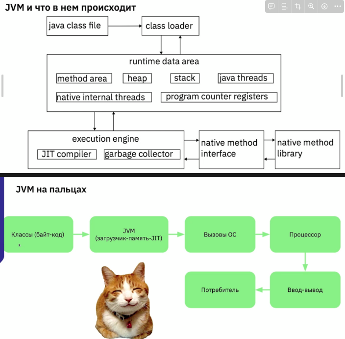
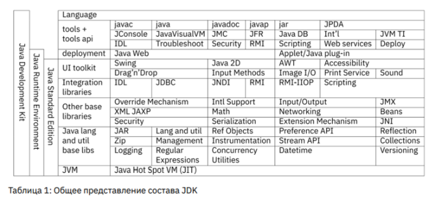

# Платформа: история и окружение.

[Методичка](https://gbcdn.mrgcdn.ru/uploads/asset/5533901/attachment/e7237c9b9384ce2300a5b03ce38c1142.pdf)

## Среда разработки

1. NetBeans - 
2. Eclipse - расширяемая и дополняемая. В том числе Java
3. Intellij IDEA - расширяемая и дополняемая. 
4. Android Studio - для мобильных устройств

## Переменные среды

Для корректной работы самого инструментария и сторонних приложений, использующих инструментарий, проследите, пожалуйста, что установлены следующие переменные среды ОС:
— в системную PATH добавить путь до исполняемых файлов JDK,
например, для UNIX-подобных систем:
PATH=$PATH:/usr/lib/jvm/jdk1.8.0_221/bin

— JAVA_HOME путь до корня JDK, например, для UNIX-подобных систем:
JAVA_HOME=/usr/lib/jvm/jdk1.8.0_221/

— JRE_HOME путь до файлов JRE из состава установленной JDK, например, для UNIX-подобных систем:
JRE_HOME=/usr/lib/jvm/jdk1.8.0_221/jre/

— J2SDKDIR устаревшая переменная для JDK, используется некоторыми
старыми приложениями, например, для UNIX-подобных систем:
J2SDKDIR=/usr/lib/jvm/jdk1.8.0_221/

— J2REDIR устаревшая переменная для JRE, используется некоторыми
старыми приложениями, например, для UNIX-подобных
систем:

— J2REDIR=/usr/lib/jvm/jdk1.8.0_221/jre/

JDK = JRE + инструменты разработчика

JRE = JVM + библиотеки классов

JVM = Native APi + механизм исполнения + управление памятью

JVM для своей работы запрашивает у ОС некоторый сегмент оперативной памяти, в котором хранит данные программы. Это хранение происходит «слоями»:

1. Eden Space (heap) – в этой области выделяется память под все создаваемые из программы объекты. Большая часть объектов живёт недолго (итераторы, временные объекты, используемые внутри методов и т.п.), и удаляются при 1 JIT, just-in-time — англ. во́ время, прямо сейчас выполнении сборок мусора это области памяти, не перемещаются в другие области памяти. Когда данная область заполняется (т.е. количество выделенной памяти в этой области превышает некоторый заданный процент), сборщик мусора выполняет быструю (minor collection) сборку. По сравнению с полной сборкой, она занимает мало времени, и затрагивает только эту область памяти, а именно, очищает от устаревших объектов Eden
Space и перемещает выжившие объекты в следующую область.

2. Survivor Space (heap) – сюда перемещаются объекты из предыдущей области после того, как они пережили хотя бы одну сборку мусора. Время от времени долгоживущие объекты из этой области перемещаются в Tenured Space. 

3. Tenured (Old) Generation (heap) — Здесь скапливаются долгоживущие объекты (крупные высокоуровневые объекты, синглтоны, менеджеры ресурсов и прочие). Когда заполняется эта область, выполняется полная сборка мусора (full, major collection), которая обрабатывает все созданные JVM объекты.

4. Permanent Generation (non-heap) – Здесь хранится метаинформация,
используемая JVM (используемые классы, методы и т.п.).

5. Code Cache (non-heap) — эта область используется JVM, когда включена JITкомпиляция, в ней кешируется скомпилированный
платформенно-зависимый код.




JVM интегрирована в  JRE - . 

JRE (Java Runtime Environment)- это набор из классов и интерфейсов, реализующих 

— возможности сетевого взаимодействия;

— рисование графики и графический пользовательский интерфейс;

— мультимедиа;

— математический аппарат; — наследование и полиморфизм;

— рефлексию;

— ... многое другое.

JDK (Java Development Kit) является изрядно дополненным специальными Java приложениями SDK. JDK дополняет JRE не только утилитами для компиляции, но и утилитами для создания документации, отладки, развёртывания приложений и многими другими. 



Помимо стандартной редакции существует и Enterprise Edition, содержащий компоненты для создания веб-приложений, но JEE
активно вытесняется фреймворками Spring и Spring Boot

## Обычный проект

состоит из пакетов, которые содержат классы, которые в свою очередь как-то связаны между собой и содержат код, который исполняется.
- Пакеты. Пакеты объединяют классы по смыслу. Классы, находящиеся в одном пакете доступны друг другу даже если находятся в разных проектах. У пакетов есть правила именования: обычно это обратное доменное имя (например, для [gb.ru](http://gb.ru/) это будет [ru.gb](http://ru.gb/)), название проекта, и далее уже внутренняя структура. Пакеты именуют строчными латинскими буквами. Чтобы явно отнести класс к пакету, нужно прописать в классе название пакета после оператора package.

- Классы. Основная единица исходного кода программы. Одному файлу следует сопоставлять один класс. Название класса - это имя существительное в именительном падеже, написанное с заглавной буквы. Если требуется назвать класс в несколько слов, применяют  UpperCamelCase.

- public static void main(String[] args). Метод, который является точкой входа в программу. Должен находиться в публичном классе. При создании этого метода важно полностью повторить его сигнатуру и обязательно написать его с название со строчной буквы.

- Комментарии. Это часть кода, которую игнорирует компилятор при
преобразовании исходного кода. Комментарии бывают:

● // comment - до конца строки. Самый простой и самый часто используемый комментарий.

● /* comment */ - внутристрочный или многострочный. Никогда не используйте его внутри строк, несмотря на то, что это возможно.

● /** comment */ - комментарий-документация. Многострочный. Из него
утилитой Javadoc создаётся веб-страница с комментарием.

```java
//region <name>
# этот блок кода можно скрыть под катом
//endregion
```

Один класс - один файл

Для компиляции более сложных проектов, необходимо указать компилятору, откуда забирать файлы исходников и куда складывать готовые файлы классов, а интерпретатору, откуда забирать файлы скомпилированных классов. Для этого существуют следующие ключи:

● javac:
-d выходная папка (директория) назначения;
-sourcepath папка с исходниками проекта;

● java:
-classpath папка с классами проекта;

Кроме этого нужно указать путь к файлу *.java, содержащему главный класс.

```bash
javac -sourcepath ./src -d out src/ru/gb/jcore/sample/Main.java
```

```bash
java -classpath ./out ru.gb.jcore.sample.Main
```

Запуск программы, собранной в архив jar:

```bash
java -jar <*.jar>
```

## Javadoc

Чтобы просто создать документацию надо вызвать утилиту javadoc с набором ключей.

- ru пакет, для которого нужно создать документацию; 

- -d папка (или директория) назначения;-  -sourcepath папка с исходниками проекта; 

- -cp путь до  скомпилированных классов;

- -subpackages нужно ли заглядывать в пакеты-с-пакетами; 

Часто необходимо указать, в какой кодировке записан файл исходных кодов, и в какой кодировке должна быть выполнена документация (например, файлы исходников на языке Java всегда сохраняются в кодировке UTF-8, а основная кодировка для ОС Windows - cp1251)

-  -locale ru_RU язык документации (для правильной расстановки переносов и разделяющих знаков);

- -encoding кодировка исходных текстов программы;

- -docencoding кодировка конечной сгенерированной документации. Чаще всего в комментариях используются следующие ключевые слова:

- @param описание входящих параметров

- @throws выбрасываемые исключения

- @return описание возвращаемого значения

- @see где ещё можно почитать по теме

- @since с какой версии продукта доступен метод — {@code "public"} вставка кода в описание

- -d папка назначения

```bash
javadoc -d docs -sourcepath src -cp out -subpackages ru
```

Makefile — это набор инструкций для программы make (классическая, это
GNU Automake), которая помогает собирать программный проект в одну
команду. Если запустить make то программа попытается найти файл с именем поумолчанию Makefile в текущем каталоге и выполнить  нструкции из него.

Make, не привносит ничего принципиально нового в процесс компиляции, а только лишь автоматизируют его. В простейшем случае, в Makefile достаточно описать так называемую цель, target, и что нужно сделать для достижения этой цели. Цель, собираемая по-умолчанию называется all, так, для простейшей компиляции нам нужно написать:

```bash
all:
javac -sourcepath .src/ -d out src/ru/gb/jcore/sample/Main.java
```

Чтобы вызвать утилиту для сборки цели по-умолчанию, достаточно в папке, содержащей Makefile в терминале написать make. Чтобы воспользоваться другими написанными таргетами нужно после имени утилиты написать через пробел название таргета.

```bash
# чистит папку out
make clean
```

🔥 Внимание поклонникам войны за пробелы против табов в тексте программы: в Makefile для отступов при описании таргетов нельзя использовать пробелы. Только табы. Иначе make обнаруживает ошибку
синтаксиса.

Создание образа из докерфайла, лежащего в текущей папке и публикация его на docker.hub:

```bash
docker build . -t hellojava:latest
```

Запускает контейнер с ключом —rm, что удаляет контейнер после завершения работы программы

```bash
docker run --rm hellojava:latest
```

### ClassLoader. Загрузка классов.

Загрузку классов в Java обеспечивают наследники абстрактного класса ClassLoader. 

Java - язык с отложенной загрузкой классов, то есть загрузчик подгружает по мере обращения к конструкторам классов или статических методов. При запуске программы, системный ClassLoader загружает главный класс и выполняет статический метод main().

Текущий загрузчик можно вызвав для объекта типа Class метод:

```java
public ClassLoader getClassLoader()
```

Стандартный метод загрузки некоторого класса загрузчиком:

```java
public static Class forName(String name);

public static Class forName(String name, boolean initialize, ClassLoader loader);
```

В