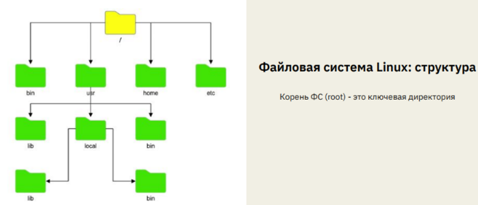

# Механизм пространства имён.



● /bin (binaries) – здесь содержатся исполняемые файлы самых необходимых
утилит. Важный момент: эта папка может быть символьной ссылкой на
/usr/bin.

● /boot – папка содержит файлы, которые необходимы для первичного этапа
загрузки ОС Linux: загрузки ядра и его компоненты.

● /dev (devices) – содержит в себе блочные и символьные файлы устройств
(диски, терминалы, клавиатуры, принтеры и так далее).

● /etc (etcetera) – хранит в себе набор конфигурационных файлов системы и
прикладных программ.

● /home – в этой директории хранятся домашние каталоги пользователей для
хранения «личных» файлов.

● /lib (libraries) – содержит в себе файлы библиотек, необходимых для работы
утилит, системного и прикладного ПО. Также может быть символьной
ссылкой на /usr/bin.

● /mnt (mount) – каталог, предназначенный для подключения файловых систем
(съемных носителей и др.). Как принято называть - точка монтирования (от
англ. mountpoint).

● /opt (optional) – каталог для различного рода дополнительных программ
(проприетарных драйверов, агентов мониторинга и др.).

● /proc (process) – одна из важнейших директорий, содержащая в себе
сущности-ссылки на файлы, содержащиеся в оперативной памяти, в которых
содержится информация о выполняемых в системе процессах.

● /root – домашний каталог пользователя root (аналог /home для других
пользователей).

● /sbin (system binaries) – содержит набор файлов системных утилит, которые необходимы для загрузки ядра ОС, резервного копирования и
восстановления системы. Также может быть символьной ссылкой на /usr/sbin.

● /sys (system) – виртуальная файловая система sysfs, которая содержит
информацию об аппаратном обеспечении (ЦПУ, ОЗУ, дисках, сетевых
устройствах), драйверах, ядре системы и др.

● /tmp – каталог для различного рода временных файлов, обычно зачищается
при каждой загрузке системы.

● /usr – ранее считалось, что это пользовательский каталог, который содержит
каталоги исполняемых файлов и конфигурационных файлов. Сейчас же -
просто каталог с исполняемыми и конфигурационными файлами.

● /var (variable) – содержит файлы, создаваемые или используемые
различными программами (различные логи, очереди, идентификаторы
процессов, базы данных и тд.).

---

chroot  - утилита, которая позволяет пользователю выполнить операцию изменения корневого каталога системы для запущенного процесса и всех его дочерних процессов. Приложение, запущенное в таком окружении, работает изолированно и не может получить доступ к остальным директориям файловой системы вне своего корневого каталога. Важный момент: для выполнения этой операции необходимо иметь права суперпользователя (sudo).

```bash
mkdir testfolder # создаем новую директорию
chroot testfolder /bin/bash
```

Вторая команда содержит в себе 2 аргумента: первый - папка, которую мы
хотим сделать корневой, второй - командный интерпретатор, который мы хотим
использовать. Здесь можно использовать и другие варианты: /bin/sh, zsh и так
далее.
Однако, в результате выполнения этой команды мы получим сообщение об
ошибке:

```bash
chroot: failed to run command ‘/bin/bash’: No such file or
directory
```

Для того, чтобы все запустилось
корректно, необходимо несколько видоизменить набор команд: создать в “новом
корне” папку bin, поместить туда исполняемый файл командного интерпретатора.

```bash
mkdir testfolder/bin
cp /bin/bash testfolder/bin
chroot testfolder
chroot: failed to run command ‘/bin/bash’: No such file or
directory
```

В результате опять ошибка. Необходимо скопировать необходимые библиотеки в новый root.  Чтобы получить список зависимостей нужно:

```bash
$ ldd /bin/bash
linux-vdso.so.1 (0x00007ffee1fd2000)
libtinfo.so.6 => /lib/x86_64-linux-gnu/libtinfo.so.6
(0x00007fdfe23e7000)
libc.so.6 => /lib/x86_64-linux-gnu/libc.so.6
(0x00007fdfe21bf000)
/lib64/ld-linux-x86-64.so.2 (0x00007fdfe2581000)
```

После того, как список необходимых зависимостей был получен, необходимо
также скопировать их в новую файловую систему и попытаться повторить наш
эксперимент:

```bash
$ cp /lib/x86_64-linux-gnu/libtinfo.so.6 testfolder/lib
$ cp /lib/x86_64-linux-gnu/libc.so.6 testfolder/lib
$ cp /lib64/ld-linux-x86-64.so.2 testfolder/lib64/
$ chroot testfolder
bash-5.1#
```

Ура! У нас все получилось. Как мы видим, теперь “приветствие” системы на ввод команды стало иным. Это и означает, что мы изолировали процесс. По сути, у нас запустилась изолированная оболочка командного интерпретатора bash, с корнем, отличным от остальной системы. Однако, попытка выполнить, например, `ll` приведёт к ошибке, потому что не скопированы необходимые исполнимые файлы. Таким образом серьёзный недостаток использования `chroot`- необходимость дублировать все необходимые файлы.

---

## Механизм пространств имен

Пространство имен (от англ. namespaces) - это абстракция в системе Linux, в которой находятся системные ресурсы. Тип ресурса зависит от типа пространства имен. Пространства имен - не какая-то дополнительная функция, которую можно установить или просто обойтись без нее. Эта сущность изначально предоставляется самим ядром ОС Linux и является необходимым компонентом, принимающим участие в процедуре запуска любого процесса в системе. *В любой момент времени любой процесс может принадлежать только одному пространству имен каждого типа.* Также namespace - это механизм, обеспечивающий изоляцию процессов друг от друга в UNIX-системах. Реализация данного механизма была начата с версии ядра 2.4.19 и продолжается по сей день.

Давайте поговорим непосредственно о типах пространства имен. На данный
момент имеется шесть типов namespace: 

- PID - Изоляция идентификатора процессов
- Network - Сетевая изоляция (сеть, порты, стеки и так далее)
- User - Изоляция пользователей и групп
- Mount - Переопределение точек монтирования
- IPC (Inter Process Communication) Изоляция межпроцессного взаимодействия (в т.ч. очереди POSIX)
- UTS (UNIX Time-Sharing) Изоляция имени хоста и доменного имени

---

Квота - количественные ограничения на что-либо.
Контейнер - это процесс в ОС Linux, с набором собственных пространств имен и квот. Также стоит отметить, что контейнер без квот вполне может принадлежать общему пространству имен, совместно используя ресурсы в них. 

Контейнеры — хорошая альтернатива аппаратной виртуализации. Они позволяют запускать приложения в изолированном окружении, но при этом потребляют намного меньше ресурсов.

PID - это идентификационный номер процесса, который обычно используется большинством ядер операционной системы, таких как Linux, Unix, macOS и Windows. Это уникальный идентификационный номер, который автоматически присваивается каждому процессу, когда он создается в операционной системе. 

Процесс – это исполняемый экземпляр программы.

Максимальное значение PID:

```bash
cat/proc/sys/kernel/pid_max
```

init - предок всех процессов, является первым процессом с PID = 1

---

ps – сообщает моментальный снимок текущих процессов.

top выводит список запущенных процессов в реальном времени.

---

uname - это инструмент, используемый для определения архитектуры процессора, hostname, domainname, версии ядра системы и многих других параметров. Вызывать его необходимо с набором параметров:

- -s, ( –kernel-name) – выводит имя ядра.
- -n, ( –nodename) – выводит имя узла системы (имя хоста). Это имя, которое система использует при общении по сети. При использовании с опцией -n uname показывает тот же вывод, что и команда hostname.
- -r, ( –kernel-release) – выводит выпуск ядра.
- -v, ( –kernel-version) – выводит версию ядра.
- -m, ( –machine) – выводит название аппаратного имени.
- -p, ( –processor) – выводит архитектуру процессора.
- -i, ( –hardware-platform) – выводит информацию об аппаратной платформе.
- -o, ( –operating-system) – распечатает название операционной системы. В системах Linux это «GNU/Linux».
- -a, ( –all) – при использовании опции -a uname ведет себя так же, как если бы были заданы опции -snrvmo.

---

## Команда `unshare`

- Запускает программу в новом пространстве имён. Может накладывать ограничения по namespaces

```bash
sudo unshare --net --pid --usr --net bash
```

the end