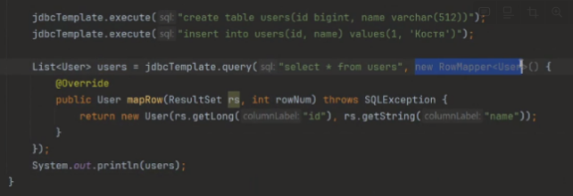

# Семинар 5.Spring Data. @Transactional

## Транзакции

Изоляция - это одно из распространенных свойств ACID: атомарность, консистенция, изоляция и долговечность. Изоляция описывает, как изменения, применяемые параллельными транзакциями, видны друг другу.

[Spring документация о Propogation, Isolation](https://www.baeldung.com/spring-transactional-propagation-isolation)

`@Transactional` аннотация, помечающая метод, который исполняется в рамках транзакции. 

`@Transactional(Propogation = Propogation.REQUIRED)` определяет поведение транзакций при вложенности методов, если это нужно

## jdbcTemplate



RowMapper это функциональный интерфейс, поэтому его можно свернуть  в лямбду

Следующий запрос находит и заполняет один объект предметной области:

```jsx
Actor actor = jdbcTemplate.queryForObject(
        "select first_name, last_name from t_actor where id = ?",
        (resultSet, rowNum) -> {
            Actor newActor = new Actor();
            newActor.setFirstName(resultSet.getString("first_name"));
            newActor.setLastName(resultSet.getString("last_name"));
            return newActor;
        },
        1212L);
```
