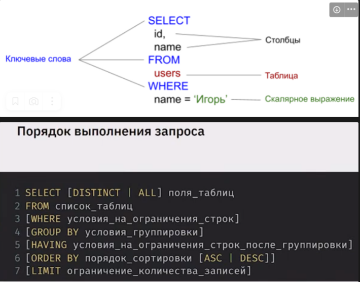

# Базы данных

> База данных -это набор взаимосвязанных даннных и правила хранения этих данных.

> Система управления базами данных (СУБД) - это комплекс программных средств для управления данными

> `Реляционные` - это БД, в которых информация структурирована в виде таблиц, связанных жёсткими правилами.

> [`Нереляционные(NoSQL)`](./nosqldb.md) - это БД, в которых жёсткие ограничения не требуются ни по структуре, ни по связи между информацией (Redis, MongoDB, Cassandra).


## Лекции GB

[Инструменты для работы с базами данных.](bd1.md)

[ДЗ1. Установка СУБД, подключение к БД, просмотр и создание  таблиц.](https://cloud.mail.ru/public/6rW3/x4YgD3C7A)

[SQL - создание объектов, изменение данных, логические операторы](bd2.md)

[ДЗ_2. Создание объектов, простые запросы выборки.](https://cloud.mail.ru/public/phfp/oEcKGdU34)


[SQL - типы данных, сортировка, агрегатные функции.](bd3.md)

[ДЗ_3: SQL - выборка данных, сортировка, агрегатные функции.](https://cloud.mail.ru/public/47qy/Cf14eJFDi)

[SQL - объединение таблиц union, соединение join, подзапросы.](db4.md)

[ДЗ_4. Объединение таблиц](https://github.com/AndrewNizovkin/HomeWorks/blob/main/sql_4/sql_4.sql)

[SQL - оконные функции.](db5.md)

[ДЗ_5: Оконные функции](https://github.com/AndrewNizovkin/HomeWorks/blob/main/sql_5/sql_5.sql)


[SQL - транзакции, ACID. Временные таблицы, управляющие конструкции, циклы.](db6.md)

[ДЗ_6. SQL - Транзакции. Временные таблицы, управляющие конструкции, циклы.](https://github.com/AndrewNizovkin/HomeWorks/blob/main/sql_6/sql_6.sql)

---
## Статьи

[Транзакции, процедуры, функции](https://www.notion.so/SQL-b3bafe187438428ab68eb6c132876085?pvs=21)

[Оптимистические и пессимистические блокировки на примере Hibernate (JPA)](https://habr.com/ru/articles/858714/)

[Статья о NoSql базах данных](https://habr.com/ru/companies/oleg-bunin/articles/319052/)

[Redis: такой простой и такой сложный](https://habr.com/ru/companies/stm_labs/articles/841792/)

[Триггеры в SQL](https://habr.com/ru/articles/37693/)

[Что нужно знать, чтобы писать быстрые SQL-запросы](https://habr.com/ru/companies/T1Holding/articles/883988/)

---



### Глоссарий

- `Идемпоте́нтность` — свойство объекта или операции при повторном применении операции к объекту давать тот же результат, что и при первом. Термин предложил американский математик Бенджамин Пирс в статьях 1870-х годов. Примеры идемпотентных операций: сложение с нулём; умножение на единицу; модуль числа; 

- `Нормализация` - уход от избыточной информации

- `Транзакция` - логическая единица работы базы данных, включающая, как правило несколько неразрывных операций, обеспечивающих сохранность данных. 

- `Реляционные системы`. Данные рассматриваются как таблицы. Relation - отношение. Relationship - связь. 

Оператор *сокращения* позволяет получить таблицу, состоящую из подмножества строк заданной таблицы.

Оператор *проекции* позволяет получить таблицу, состоящую из подмножества столбцов заданной таблицы.


> В операторах `WHERE` и `HAVING` следует использовать полное название таблицы, а не псевдоним.

```sql

SHOW TABLES; -- просмотр таблиц используемой базы

SHOW TABLES FROM gbdb; -- просмотр таблиц произвольной базы 

DESCRIBE gbdb.table_name; -- показывает структуру таблицы

SELECT DISTINCT DepartmentID FROM Employees; -- Возвращает только уникальные. Не допускает повторений.

CAST, CONVERT --преобразование данных
```

### Запуск скрипта:

**Вариант 1**
```sql
mysql> source /tmp/script.sql --запуск скрипта инструкцией source из mysgl-терминала 
```
**Вариант 2**
```swl
$ mysql -h 127.0.0.1 -P 3306 -u root -p < /tmp/script.sql
-- Enter password:
```

### Индексирование полей

Для быстрого поиска по полям создаются индексы. В этом случае будет использоваться бинарный поиск по значениям этих полей.

```sql
CREATE INDEX IX_Books_Author ON Books (Author);

CREATE INDEX IX_Books_Title ON Books (Title);

CREATE INDEX IX_Magazines_Year_Month ON Magazines (Year, Month);
```

Поле, по которому составлен индекс (упорядочены карточки) в реляционной теории называется ключом. Часто применяют составной ключ из нескольких полей, как в примере с годом и месяцем. 