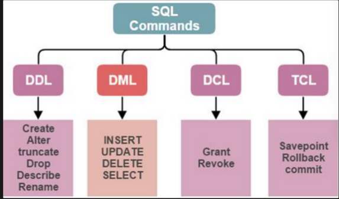

# Инструменты для работы с базами данных.

## Работа в MySQL Shell

\c root@localhost:3306

\sql - запуск mysql в MySQL Shell

\quit - выход из MySQL Shell

---

## Курс лекций

[https://pollen-attempt-4ac.notion.site/SQL-9072b1ca09f94e6fa3c588804919e1ae](https://www.notion.so/9072b1ca09f94e6fa3c588804919e1ae?pvs=21) - весь курс.

https://info-comp.ru/install-mysql-on-windows-10 - установка и настройка MySQL

---

## Полезные ссылки и рекомендации:

- https://habr.com/ru/company/oleg-bunin/blog/348172/ - естественные и суррогатные ключи
- Руководство по стилю написания SQL: https://www.sqlstyle.guide/ru/
- Старайтесь не использовать русские буквы при работе с СУБД

---

**Нормализация** — это процесс организации данных в базе данных, Она включает в себя создание таблиц и установление связей между ними в соответствии с правилами, разработанными как для защиты данных, так и для повышения гибкости базы данных, устраняя избыточность и несогласованную зависимость.

> Привести к 3НФ (третья нормальная форма) - значит выделить из таблицы первичный ключ, который будет уникально идентифицировать запись в таблцице.

**Первичный ключ (Primary key)** – поле(или набор полей) позволяющее однозначно идентифицировать запись в БД. Если ключ состоит из нескольких полей его называют составным. 

Связь происходит по **внешнему ключу**. 

**Внешний ключ (foreign key**) - поле в  таблице, значение которого соответствует первичному ключу в другой таблице. Обратите внимание, что внешний ключ может ссылаться на существующий первичный.

**Суррогатный ключ** - автоматически сгенерированное уникальное поле, никак не связанное с информационным содержанием записи.

**Естественный ключ** — ключ, состоящий из информационных полей таблицы.

http://db-engines.com/ - база знаний по системам управления реляционными и NoSQL базами данных

# **Основные операторы SQL**

***Оператор (statement)** — это наименьшая автономная часть языка программирования, команда или набор команд. (примеры из языков программирования:* 

# **DDL (Data Definition Language)**

Эта группа операторов для определения данных. Они необходимы, когда нужно произвести манипуляции с таблицами. Эти операторы SQL используются в тех случаях, когда нужно создать в базе новую таблицу или, напротив, удалить старую. Они включают в себя следующие командные слова:

- **CREATE** — создание нового объекта в существующей базе.
- **ALTER** — изменение существующего объекта.
- **DROP** — удаление объекта из базы.

# **DML (Data Manipulation Language)**

Эти операторы языка SQL предназначены для манипуляции данными. С помощью операторов мы можем изменять содержимое таблиц. Они помогают добавлять и удалять информацию, изменять значение строк, столбцов и прочих атрибутов. Эти операторы помогают удалить заказ, который отменили клиенты популярного маркетплейса. Это операторы:

- **SELECT** — позволяет выбрать данные в соответствии с необходимым условием.
- **INSERT** — осуществляют добавление новых данных.
- **UPDATE** — производит замену существующих данных.
- **DELETE** — удаление информации.

# **DCL (Data Control Language)**

Операторы, позволяющие предоставлять право доступа к файлам. Делают файлы либо приватными, либо открытыми. Операторы необходимы, чтобы ограничить кого-либо из сотрудников в доступе к информации или, наоборот, позволить работать с базой новому специалисту.

- **GRANT**— предоставляет доступ к объекту.
- **REVOKE**— аннулирует выданное ранее разрешение на доступ.
- **DENY**— запрет, который прекращает действие разрешения.

# **TCL (Transaction Control Language)**

Данный блок операторов предназначен для управления транзакциями. Слово “транзакция” знакомо нам из банковской сферы. На самом деле, транзакция - набор инструкции, которые выполняются как единое целое. У транзакции всего два исхода: проведена успешно, если все необходимые команды выполнены или откат, если в какой-либо инструкции произошёл сбой, то вся операция, включая предыдущие команды, отменяется. 

- **BEGIN TRANSACTION** — начало транзакции.
- **COMMIT TRANSACTION** — изменение команд транзакции.
- **ROLLBACK TRANSACTION** — отказ в транзакции.
- **SAVE TRANSACTION** — формирование промежуточной точки сохранения внутри операции.

# **Основные компоненты СУБД**

---

Попробуем построить обобщенную архитектуру СУБД, несмотря на большое количество различных вендоров и СУБД можно выделить общие функциональные блоки:

а)	подсистема постоянного хранения данных (Storage Engine).  В большинстве случаев СУБД использует файлы и каталоги операционной системы, некоторые, например Oracle могут работать напрямую с дисками минуя слой операционной системы. Может использоваться сжатие данных.

б)	парсер и транслятор запросов (Query parser). СУБД получает от пользователя SQL запрос (это текст) его необходимо проверить на синтаксис, перевести (транслировать) во внутренний формат, определить какие объекты, таблицы например используются

в)	оптимизатор запросов (Query optimizer) Запрос не определяет четкого алгоритма действий над объектами (в каком порядке соединять таблице, какие индексы использовать и многие другие технические детали), поэтому СУБД пытается построить наиболее оптимальный план выполнения — алгоритм выполнения запроса. Дальше в СУБД будет выполняться выбранный план запроса.

г)	подсистема выполнения (Query executor). Получает готовый план и шаг за шагом выполняет инструкции.

д)	системы кэширования данных. Обращение в постоянное хранилище, к жесткому диску довольно дорогостоящий и медленный процесс, поэтому часто используемые данные СУБД пытаются кэшировать — хранить например в оперативной памяти или ssd дисках.

# **Запрос выборки данных с простыми условиями**

Давайте разберем синтаксис простого SQL запроса выборки данных и научимся читать его определение. Многие операторы вам уже знакомы

1. Вывод всех данных из таблицы

**SELECT** * **FROM** student;

Этим запросом будут выведены все строки из таблицы student и все столбцы ( * - означает все доступные стобцы)

2. Вывод ограниченного числа столбцов — нужно явно перечислить столбцы

**SELECT** fio, login **FROM** student;

Этим запросом будут выведены все строки из таблицы student, но только столбцы fio и login

3. Применение фильтров, отбор данных по условиям

**SELECT** * **FROM** student **WHERE** login=’test2’;

## 4. Применение оператора “LIKE”:

Оператор имеет ряд символов подстановки:

”%”  - любая подстрока, которая имеет любое количество символов, либо является пустой. 

Пример: "WHERE Car LIKE 'Audi%' соответствует таким значениям как: "Audi A3" / "Audi Q3”,”Audi TT”

- "Audi A3"
- "Audi Q3”
- ”Audi TT”
- “Audi RS4”

“_”  - любой одиночный символ

Пример: "WHERE Car LIKE 'Audi А_' соответствует таким значениям как:

- "Audi A3"
- "Audi A4"
- "Audi A6"
- "Audi A8"

После буквы “А” идет 1 одиночный символ.

## Полезные ссылки и рекомендации:

- https://habr.com/ru/company/oleg-bunin/blog/348172/ - естественные и суррогатные ключи
- Руководство по стилю написания SQL: https://www.sqlstyle.guide/ru/
- Старайтесь не использовать русские буквы при работе с СУБД

Книги:

- “Изучаем SQL”, книга Бейли Л.
- Алан Бьюли "Изучаем SQL" (2007)
- Энтони Молинаро "SQL. Сборник рецептов" (2009)