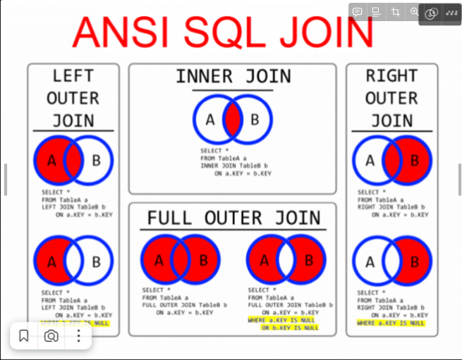

# SQL - объединение таблиц union, соединение join, подзапросы.

# Многотабличные запросы




До этого мы обращались только к одной таблице, но настало время попробовать многотабличные
запросы, результат в которых можно формировать из двух и более таблиц.
Многотабличные запросы условно можно поделить на три большие группы:

● объединение UNION,

● вложенные запросы

● JOIN-соединения.

Сильная сторона SQL — то, что в его основе лежит теория множества. В отличие от других языков программирования, мы оперируем не отдельными значениями, а их наборами. В теории множеств описывается, как можно складывать и вычитать такие наборы или получать их пересечения.

Вложенный запрос позволяет использовать результат, возвращаемый одним запросом, в другом. Здесь синим цветом представлены точки в запросе, где мы можем использовать вложенные запросы.

```sql
SELECT id,
  <SUBQUERY>
FROM
  <SUBQUERY>
WHERE
  <SUBQUERY>
GROUP BY
  id
HAVING
  <SUBQUEY>
```

И, наконец, третий тип запросов — это JOIN-соединения. Они очень похожи на UNION-запросы, однако вместо объединения однотипных результатов, допускают соединения совершенно разноплановых таблиц, задействуя связь «первичный-внешний ключ».

---

# 1. Объединение UNION

Если формат результирующих таблиц совпадает, возможно объединение результатов выполнения двух операторов **SELECT** в одну результирующую таблицу. Для этого используется оператор **UNION**. Важное условие — совпадение всех параметров результирующих запросов. Количество, порядок следования и тип столбцов должны совпадать. Для демонстрации работы **UNION**-запроса создадим таблицу rubrics, структура которой полностью совпадает с таблицей catalogs:

```sql
DROP TABLE IF EXISTS catalogs;
CREATE TABLE catalogs (
	id INT UNSIGNED,
	name VARCHAR(255) COMMENT 'Название раздела'
) COMMENT = 'Разделы интернет-магазина';

INSERT INTO catalogs (name) VALUES ('Процессоры');
INSERT INTO catalogs VALUES (0, 'Мат.платы');
INSERT INTO catalogs VALUES (NULL, 'Видеокарты');

DROP TABLE IF EXISTS rubrics;
CREATE TABLE rubrics (
	id SERIAL PRIMARY KEY,
	name VARCHAR(255) COMMENT 'Название раздела'
) COMMENT = 'Разделы интернет-магазина';
INSERT INTO rubrics 
VALUES
	(NULL, 'Видеокарты'),
	(NULL, 'Память');
```

Получаем уникальные данные из двух таблиц, используя UNION:

```sql
SELECT name FROM catalogs
UNION
SELECT name FROM rubrics;
```

Обратите внимание, что в результирующий запрос попадают только не повторяющиеся результаты. Несмотря на то, что раздел «Видеокарты» присутствует и в первой, и во второй таблицах, в результирующий запрос этот раздел попал в единственном экземпляре.

Если необходимо вывести все данные без повторения, используется оператор **UNION ALL**:

```sql
SELECT name FROM catalogs
UNION ALL
SELECT name FROM rubrics;
```

# 2. Вложенные запросы

Вложенный запрос позволяет использовать результат, возвращаемый одним запросом, в другом. Синтаксис основного запроса остается неизменным, однако в местах помеченным синим цветом, можно использовать подзапрос или, как еще говорят, вложенный запрос:

```sql
SELECT id,
  <SUBQUERY>
FROM
  <SUBQUERY>
WHERE
  <SUBQUERY>
GROUP BY
  id
HAVING
  <SUBQUEY>
```

Чтобы СУБД могла отличать основной запрос и подзапрос, последний заключают в круглые скобки.  Попробуем вернуть максимальную цену из всех товаров, но без агрегатной функции:

```sql
SELECT *,
	(SELECT MAX(price) FROM products ) AS 'max_price'
FROM products;
```

---

## Подзапросы

Оператор IN:

```sql
# Выбрать все товары из таблицы Products, на которые
# есть заказы в таблице Orders
SELECT * FROM Products
WHERE id IN (SELECT ProductId FROM Orders)

# Выбрать те товыры, на которые  нет заказов
# в таблице Orders
SELECT * FROM Products
WHERE id NOT IN (SELECT ProductId FROM Orders)
```

Оператор EXISTS:

```sql
USE productdb;

WHERE [NOT] ESISTS (подзапрос)

# Пример:
SELECT * FROM Products
WHERE EXISTS
  (SELECT * FROM Orders WHERE Orders.ProductId = Products.id);
```

Оператор CREATE TABLE :

```sql
CREATE TABLE yourTableName SELECT * FROM youOriginalTable;
```

# 3. JOIN - соединения таблиц

1. **INNER JOIN**: возвращает записи с совпадающими значениями в обеих таблицах.
2. **LEFT JOIN:** возвращает все записи из левой таблицы и соответствующие записи из правой
таблицы.
3. **RIGHT JOIN**: возвращает все записи из правой таблицы и соответствующие записи из левой таблицы.
4. **CROSS JOIN:** возвращает все записи из обеих таблиц.

Рассмотрим каждый из типов:

1. **CROSS JOIN**

Первый тип соединения - декартово произведение или CROSS JOIN.

В MySQL CROSS JOIN генерирует результирующий набор, который является произведением строк двух связанных таблиц. Каждая строка одной таблицы соединяется с каждой строкой второй таблицы, давая тем самым в результате все возможные сочетания строк двух таблиц.

```sql
CREATE TABLE fst(
	value VARCHAR(255)
);
INSERT INTO fst
VALUES
	('fst1'),
	('fst2'), 
	('fst3');
CREATE TABLE snd(
	value VARCHAR(255)
);
INSERT INTO snd
VALUES 
	('snd1'), 
  ('snd2'), 
  ('snd3');

SELECT * FROM snd
CROSS JOIN fst;
```

Размер в таком случае можно определить по формуле: **M * N**, где **M** - количество строк в первой таблице, **N** - количество строк во второй таблице. Если **M =** `40`, **N =**`60`, то **CROSS JOIN** вернет нам `2400`строк.

---

1. **INNER JOIN**

Оператору передаются две таблицы, и он возвращает их внутреннее пересечение по какому-либо критерию. Результатом будут записи, которые соответствуют обеим таблицам, — их перед отправкой объединят. 
**Пример(для понимания):**
Например, если в одной таблице будут перечислены черные животные, а в другой — собаки, то **INNER JOIN** вернет одну таблицу с перечислением черных собак. Столбцы будут «склеены» друг с другом, несмотря на то что в базе данные хранятся в разных таблицах. Это похоже на бинарное «и» из алгебры логики.

```sql
SELECT столбцы
FROM таблица1
    [INNER] JOIN таблица2
    ON условие1
    [[INNER] JOIN таблица3
    ON условие2]
```

**Пример(кодом):**

Возвращает записи с совпадающими значениями в обеих таблицах. Модифицируем наши таблицы:

```sql
DROP TABLE IF EXISTS catalog;
CREATE TABLE catalog (
  id INT PRIMARY KEY AUTO_INCREMENT,
  name VARCHAR(255) COMMENT 'Название раздела',
  UNIQUE unique_name(name(10))
) COMMENT = 'Разделы интернет-магазина';

INSERT INTO catalog (name)
VALUES
  ('Процессоры'), -- id = 1
  ('Материнские платы'),-- id = 2
  ('Видеокарты'),--  id = 3
  ('Жесткие диски'), -- id = 4
  ('Оперативная память');-- id = 5
  
DROP TABLE IF EXISTS product;
CREATE TABLE product (
  id INT PRIMARY KEY AUTO_INCREMENT,
  name VARCHAR(255) COMMENT 'Название',
  description TEXT COMMENT 'Описание',
  price DECIMAL (11,2) COMMENT 'Цена',
  catalog_id INT,
  created_at DATETIME DEFAULT CURRENT_TIMESTAMP,
  updated_at DATETIME DEFAULT CURRENT_TIMESTAMP ON UPDATE CURRENT_TIMESTAMP,
  FOREIGN KEY  (catalog_id) REFERENCES catalog(id)
) COMMENT = 'Товарные позиции';
SELECT * FROM catalog;

INSERT  product(name, description, price, catalog_id)
VALUES
  ('Intel Core i3-8100', 'Процессор для настольных персональных компьютеров, основанных на платформе Intel.', 7890.00, 1),
  ('Intel Core i5-7400', 'Процессор для настольных персональных компьютеров, основанных на платформе Intel.', 12700.00, 1),
  ('AMD FX-8320E', 'Процессор для настольных персональных компьютеров, основанных на платформе AMD.', 4780.00, 1),
  ('AMD FX-8320', 'Процессор для настольных персональных компьютеров, основанных на платформе AMD.', 7120.00, 1),
  ('ASUS ROG MAXIMUS X HERO', 'Материнская плата ASUS ROG MAXIMUS X HERO, Z370, Socket 1151-V2, DDR4, ATX', 19310.00, 2),
  ('Gigabyte H310M S2H', 'Материнская плата Gigabyte H310M S2H, H310, Socket 1151-V2, DDR4, mATX', 4790.00, 2),
  ('MSI B250M GAMING PRO', 'Материнская плата MSI B250M GAMING PRO, B250, Socket 1151, DDR4, mATX', 5060.00, 2);
```

Выведем товар и его группу. Для этого выберем столбцы, которые нас интересуют из каждой таблицы. Мы видим, что в табличке products имеется ссылка на табличку catalogs . Если эти ссылки равны, то мы узнаем товар и принадлежность к группе.

```sql
SELECT p.name,
	p.price,
	c.name
FROM catalog AS c
JOIN product AS p
ON c.id = p.catalog_id;
```

---

1. **LEFT JOIN.**

**LEFT JOIN** и **RIGHT JOIN** осуществляют левое и правое соединение, в результирующей таблице присутствуют все записи левой или правой таблицы, даже если им нет подходящего сопоставления.

**Пример(кодом):**
Допустим, попробуем получить полную информацию о каталоге товаров. Даже если товар не продается, мы будем его выводить. Для этого нам нужен LEFT JOIN. В запросе первая таблица всегда является **левой**, вторая - **правой. Для запроса выше левая таблица - catalog, правая - product.**

В таблице catalogs у нас три записи, для раздела «Видеокарты» сопоставления в таблице products нет, поэтому эта запись не попадает в результирующую таблицу JOIN-соединения. Обратите внимание, что в **catalog** есть группы видеокарт , жестких дисков и процессоров, а в табличке **product таких товаров нет. Если совпадений не найдено, возвращается значение NULL.**

```sql
SELECT
	p.name,
	p.price,
	c.name
FROM catalog AS c -- Берется левая таблица и совпадения из правой
LEFT JOIN product AS p -- Правая таблица
ON c.id = p.catalog_id; -- Условие для совпадения (область пересечения 2 множест
```

1. RIGHT JOIN

**Пример(для понимания):**

Работает по тому же принципу, но вместо левой таблицы — правая. То есть человек получит в результатах боевики, только если они русские.

**Пример(кодом):**

Аналогично, можем посмотреть товары и группы, к которым они принадлежат.

```sql
SELECT * FROM catalogs;
SELECT
	p.name,
	p.price,
	c.name
FROM catalog AS c -- Левая таблица
RIGHT JOIN product AS p -- Правая таблица
ON c.id = p.catalog_id; -- Условие для совпадения (область пересечения 2 множеств)
```

Запрос очень напоминает INNER JOIN, но почему? Дело в том, что продукт имеет ссылку на каталог. Нет такого значения, которое бы не ссылалось на каталог (имеется внешний ключ, который ссылается ТОЛЬКО на реальные объекты в вашей БД).

Так же имеет смысл рассмотреть **FULL JOIN** в MySQL. **FULL JOIN** возвращает обе таблицы, объединенные в одну.  Данный тип соединения не поддерживается, так как операция считается избыточной. Мы можем реализовать **FULL JOIN**, объединив два запроса при помощи **UNION**, оставив только уникальные значения или **UNION ALL**, который не удаляет дубликаты. В первом запросе будем использовать **LEFT JOIN**, а во втором - **RIGHT JOIN**.

**Пример(кодом):**

Попробуем объединить табличку **product** с таблицей **catalog, удалив дубликаты.**

```sql
SELECT p.name, p.price, c.name
FROM catalog AS c
LEFT JOIN product AS p
ON c.id = p.catalog_id

UNION -- Удалили дубликаты

SELECT p.name, p.price, c.name
FROM catalog AS c
RIGHT JOIN product AS p
ON c.id = p.catalog_id;
```

Иногда имеет смысл не удалять дубликаты. В таком случае используется оператор **UNION ALL**.

```sql
SELECT p.name, p.price, c.name
FROM catalog AS c
LEFT JOIN product AS p
ON c.id = p.catalog_id

UNION ALL -- дубликаты не удалили

SELECT p.name, p.price, c.name
FROM catalog AS c
RIGHT JOIN product AS p
ON c.id = p.catalog_id;
```

# **Парочка вопросов из реальных собеседований**

1. Представьте, что запрос с оператором **UNION** и **UNION ALL** вернул одинаковое количество строчек (пусть вернулось 10 строчек). Какой из операторов сработал быстрее и почему?

**Ответ**: сработает быстрее UNION ALL, оператор не делает проверку на уникальность