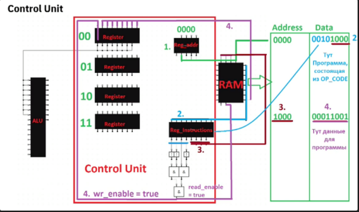

# Устройство CPU

`Arithmetic Logic Unit (ALU)` - Основной элемент, позволяющий делать арифметические и логические операции над блоками битов.

`RS_latch или RS_trigger` - “защёлкивает состояние”

`D_latch (D_trigger)` - выступает в роли хранителя 1 бита, благодаря разрешению записи или его отсутствию

`RAM` - оперативная память. К ней обращаются по определённому адресу (строка, столбец)

`Control Unit` - содержит регистры памяти, вспомогательные регистры адресов, регистры инструкции и др. Контролирует работу, считывает определённые инструкции по определённому адресу, достаёт определённые инструкции по определённому адресу, достаёт из них Opcode, применяет их к определённым адресам в RAM.

Соединив `Control Unit` c `ALU` получим `CPU (Central Process Unit)`, который будет связан с RAM и будет выполнять инструкции, то есть программу, которая в RAM загружена

`Clock` - устройство, которое позволяет включать те или иные схемы в какой-то определённый момент времени, чтобы всё выполнялось последовательно. Включение и выключение определённых частей схемы в CPU можно назвать итерацией.

