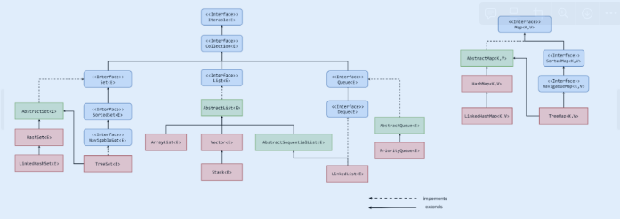

# Коллекции

[Методичка](https://gbcdn.mrgcdn.ru/uploads/asset/5580407/attachment/0cea3e878df5bb6e978580c7d8f0b832.pdf)



Компоненты нового каркаса коллекций не являются потокобезопасными. Нужно воспользоваться алгоритмами из класса Collections типа SinchronizedList, чтобы получить их потокобезопасные версии. 

В отличие от них, унаследованные классы Stack, Properties, HashTable, Vector являются потокобезопасными.

Некоторые методы различных коллекций могут генерировать исключения:

- NoSuchElementException если в вызывающей коллекции отсутствуют какие нибудь элементы
- ClassCastException если заданный элемент несовместим с элементами  коллекции
- NullPointerException при попытке использовать null, если это недопустимо
- IllegalArgumentException при указании неверного аргумента

### Collection

```java
Interface Collection<E>
```

Интерфейс, расширяющий Iterable, что позволяет перебирать все коллекции в цикле  в стиле for each. Находится на вершине иерархии каркаса коллекций и определяет основные методы для работы с коллекциями:

```java
https://www.notion.so/9c7a9f11ecdf4b23bec86244b1e33127?pvs=21boolean add(E object)

boolean clear()

boolean contains(Object object)

boolean isEmpty()

Iterator<E> iterator()

default Stream<E> paralleleStream()

default boolean removeIf(Predicate<? super E> predicate)

int size()

default Spliterator<E> spliterator()

default Stream<E> stream()

Object[] toArray()

<T> T[] toArray(T[] array)

```

### List

```java
Interface List<E>
```

Определяет такое поведение коллекции, при котором сохраняется последовательность элементов, которые можно получить по индексу. Может содержать одинаковые элементы.

Начиная с JDK 9 внедрён фабричный перегруженный метод of() для создания неизменяемой формы List, составленной из переданных аргументов.

```java
static <E> List<E> of(E ... objects)

.....
// null-элементы не допустимы
```

### Set

```java
Interface Set<>
```

Определяет поведение коллекций, не допускающих дублирования элементов.

Имеет фабричный метод:

```java
static <E> Set<E> of(E ... objects)
```

### SortedSet

```java
interface SortedSet<E>
```

Расширяет интерфейс Set. Определяет поведение множеств, отсортированных в порядке возрастания.

### NavigableSet

```java
interface NavigableSet<E>
```

Расширяет интерфейс SortedSet. Определяет поведение коллекции, извлечение элементов из которой осуществляется на основании наиболее точного совпадения с заданным значением или несколькими значениями.

Queue

```java
interface Queue<E>
```

Определяет поведение очереди по принципу первым вошёл, первым обслужен.

### Dequeue

```java
interface Dequque<>
```

Определяет поведение

Некоторые методы различных коллекций могут генерировать исключения:

- `NoSuchElementException` если в вызывающей коллекции отсутствуют какие нибудь элементы

- `ClassCastException` если заданный элемент несовместим с элементами  коллекции

- `NullPointerException` при попытке использовать null, если это недопустимо

- `IllegalArgumentException` при указании неверного аргумента

### Collection

`java Interface Collection<E>` 

Интерфейс, расширяющий Iterable, что позволяет перебирать все коллекции в цикле  в стиле for each. Находится на вершине иерархии каркаса коллекций и определяет основные методы для работы с коллекциями:

### List

`java Interface List<E>` 

Определяет такое поведение коллекции, при котором сохраняется последовательность элементов, которые можно получить по индексу. Может содержать одинаковые элементы.

Начиная с JDK 9 внедрён фабричный перегруженный метод of() для создания неизменяемой формы List, составленной из переданных аргументов.

`java static <E> List<E> of(E ... objects)  ..... // null-элементы не допустимы` 

### Set

`java Interface Set<>` 

Определяет поведение коллекций, не допускающих дублирования элементов.

Имеет фабричный метод:

`java static <E> Set<E> of(E ... objects)` 

### SortedSet

`java interface SortedSet<E>` 

Расширяет интерфейс Set. Определяет поведение множеств, отсортированных в порядке возрастания.

### NavigableSet

`java interface NavigableSet<E>` 

Расширяет интерфейс SortedSet. Определяет поведение коллекции, извлечение элементов из которой осуществляется на основании наиболее точного совпадения с заданным значением или несколькими значениями.

Queue

`java interface Queue<E>` 

Определяет поведение очереди по принципу первым вошёл, первым обслужен.

### Dequeue

`java interface Dequque<>` 

Определяет поведение двухсторонней очереди.

Методы push(), pop() позволяют использовать как стек.

### Классы коллекций

- AbstractCollection

- AbstractList

- AbstractQueue

- AbstractSequentalList

- LinkedList

- ArrayList

- ArrayDeque

- AbstractSet

- EnumSet

- HashSet

- LinkedHashSet

- TreeSet
 
ние двухсторонней очереди.

Методы push(), pop() позволяют использовать как стек.

### Классы коллекций

- AbstractCollection

- AbstractList

- AbstractQueue

- AbstractSequentalList

- LinkedList

- ArrayList

- ArrayDeque

- AbstractSet

- EnumSet

- HashSet

- LinkedHashSet

- TreeSet