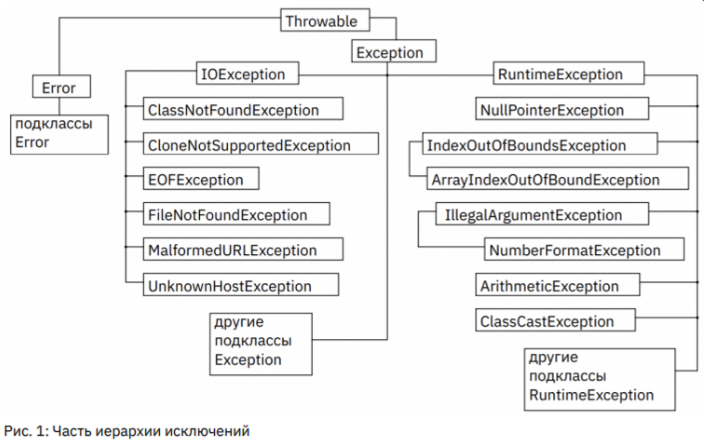

# Специализация: ООП и исключения.

[Методичка](https://gbcdn.mrgcdn.ru/uploads/asset/5534174/attachment/0e4b64bd602d953af7c8eafb3d91c692.pdf)

---

## Перечисления

это специальные классы, содержащие внутри себя собственные статические экземпляры.

```java
enum Season {
WINTER, SPTING, SUMMER, OUTUMN
}
```

Переменная типа перечисления может хранить один из экземпляров этого перечисления.

```java
Season current = Season.AUTUMN;

Season[] seasons = Season.values();
for (Season s: seasons) {
    System.out.printf("%s ", s);
}

//> WINTER SPTING SUMMER OUTUMN

System.out.println(current.ordinal);

//> 3
```

Поскольку enum по сути класс, то он может иметь поля и методы и т.д.

```java
public class Main {
    enum Color {
        RED("#FF0000"), GREEN("#00FF00"), BLUE("#0000FF");
        String code;
        Color (String code) {
             this.code = code;
        }
        String getCode() {
            return code;
        }
    }

    public static void main(String[] args) {
        for (Color c: Color.values()) {
            System.out.printf("%s(%s) ", c, c.getCoe);
        }
    }
}
```

## Внутренние и вложенные классы

В Java есть возможность создавать классы внутри других классов, все такие классы разделены на следующие типы:

1. Non-static nested (inner) classes — нестатические вложенные (внутренние) классы;

● Локальные классы (local classes);

● Анонимные классы (anonymous classes);

2. Static nested classes — статические вложенные классы. Для рассмотрения анонимных классов понадобятся дополнительные знания об интерфейсах, поэтому будут рассмотрены позднее

Код внутреннего класса имеет доступ ко всем полям и метода экземпляра и статических членов.

Код внешнего класса не имеет доступа напрямую к членам внутреннего класса без создания экземпляра.

**Особенности внутренних классов:** 

● Внутренний объект не существует без внешнего. Это логично – для этого Juice был создан внутренним классом, чтобы в программе не появлялись апельсиновые соки из воздуха.

● Внутренний объект имеет доступ ко всему внешнему. Код внутреннего класса имеет доступ ко всем полям и методам экземпляра (и к статическим членам) окружающего класса, включая все члены, даже объявленные как private.

● Внешний объект не имеет доступа ко внутреннему без создания объекта. Это логично, так как экземпляров внутреннего класса может быть создано сколь угодно много, и к какому именно из них обращаться?

● У внутренних классов есть модификаторы доступа. Это влияет на то, где в программе возможно создавать экземпляры внутреннего класса.
Единственное сохраняющееся требование — объект внешнего класса тоже обязательно должен существовать и быть видимым.

● Внутренний класс не может называться как внешний, однако, это правило не распространяется ни на поля, ни на методы;

● Во внутреннем классе нельзя иметь не-final статические поля. Статические поля, методы и классы являются конструкциями верхнего уровня, которые не связаны с конкретными объектами, в то время как каждый внутренний класс связан с экземпляром окружающего класса.

● Объект внутреннего класса нельзя создать в статическом методе «внешнего» 
класса. Это объясняется особенностями устройства внутренних классов. У внутреннего класса могут быть конструкторы с параметрами или только конструктор по умолчанию. Но независимо от этого, когда создаётся объект внутреннего класса, в него неявно передаётся ссылка на объект внешнего класса.

● Со внутренними классами работает наследование и полиморфизм.

## Локальные классы

Классы – это новый тип данных для программы, поэтому технически возможно создавать классы, а также описывать их, например, внутри методов. Это довольно редко используется но синтаксически язык позволяет это сделать. Локальные классы — это подвид внутренних классов. Однако, у локальных классов есть ряд важных особенностей и отличий от внутренних классов. Главное заключается в их объявлении.

*Локальный класс объявляется только в блоке кода. Чаще всего —
внутри какого-то метода внешнего класса.*

**Особенности локальных классов:**
● Локальный класс сохраняет доступ ко всем полям и методам внешнего
класса, а также ко всем константам, объявленным в текущем блоке кода, то есть полям и аргументам метода объявленным как final. Начиная с JDK 1.8 локальный класс может обращаться к любым полям и аргументам метода объявленным в текущем блоке кода, даже если они не объявлены как final, но только в том случае если их значение не изменяется после инициализации. 

● Локальный класс должен иметь свои внутренние копии всех локальных
переменных, которые он использует (эти копии автоматически создаются
компилятором). Единственный способ обеспечить идентичность значений локальной переменной и ее копии – объявить локальную переменную как final.

● Экземпляры локальных классов, как и экземпляры внутренних классов,
имеют окружающий экземпляр, ссылка на который неявно передается всем конструкторам локальных классов. То есть, сперва должен быть создан экземпляр внешнего класса, а только затем экземпляр внутреннего класса

## Статические вложенные классы

Статический вложенный класс может обращаться только к статическим полям внешнего класса. При этом неважно, какой модификатор доступа имеет статическая переменная во внешнем классе.

Не следует путать объекты с переменными. Если речь идёт о статических переменных — да, статическая переменная класса существует в единственном экземпляре. Но применительно ко вложенному классу static означает лишь то, что его объекты не содержат ссылок на
объекты внешнего класса.

## Исключения

При возникновении ошибок создаётся объект класса «исключение», и в этот объект записывается какое-то максимальное количество информации о том, какая ошибка произошла, чтобы потом прочитать и понять, где проблема. Соответственно эти объекты возможно «ловить и обрабатывать».


