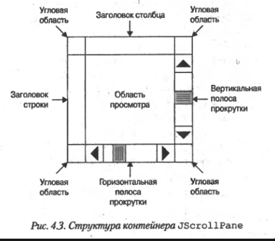

# Панели.

Чтобы установить панель содержимого в контейнере JFrame, надо использовать метод:

```java
void setContentPane(Conteiner panel)
// panel - непрозрачный контейнер
```

Таковым может быть класс, расширяющий JPanel.

### JPanel

Это контейнер общего назначения, предназначенный для размещения других компонентов.

Использует отключаемую двойную буферизацию.

```java
JPanel()

JPanel(LayoutManager lm)

Jpanel(LayaoutManager lb, boolean doubleBuf)
```

По умолчанию непрозрачен, но:

```java
void setOpaque(boolean isOpaque)
```

### JScrollPane



```java
JScrollPane()

JScrollPane(Component comp)

JScrollPane(int vertSBP, int horizSBP)

JScrollPane(Component comp, int vertSBP, int horizSBP)

// Политика прокрутки для vertSBP, horizSBP по умолчанию:
// VERTICAL_SCROLLBAR_AS_NEEDED и HORIZONTAL_SCROLLBAR_AS_NEEDED
```

Для использования угловых областей нужно установить политику полос прокрутки в значения HORIZONTAL_SCROLLBAR_ALWAYS, VERTICAL_SCROLLBAR_ALWAYS используя методы:

```java
void setVerticalScrollBarPolicy(int vertSBP)

void setHorizontalScrollBarPolicy(int horizSBP)
```

Чтобы поместить компонент в угловую область, нужно вызвать метод:

```java
void setCorner(String which, Component comp)
// wichd - константа: LOWER_LEFT_CORNER, UPPER_RIGHT_CORNER,...
```

Можно добавить заголовки строки или столбца:

```java
void setRowHeaderView(Component comp)

void setColumnHeaderView(Component comp)
```

Рамка вокруг области просмотра:

```java
void setViewportBorder(Border border)
```

### JTabbedPane

Управляет компонентами, размещая их на вкладках

```java
JTabbedPane()

JTabbedPane(int where)

JTabbedPane(int where, int sclrOrWrap)

// where - где размещать закладки: JTabbedPane.TOP, JTabbedPaneLEFT,...
// sclrOrWrap - при большом количестве закладок: JTabbedPane.WRAP_TAB_LAYOUT или JTabbedBane.SCROLL_TAB_LAYAOUT
```

Закладки добавляются одним из методов:

```java
void addTab(String name, Component comp)

void addTab(String name, Icon image, Component comp)

void addTab(String name, Icon image, Component comp, String tooltip)

void insertTab(String name, Icon image, Component comp, String tooltip, int idx)

```

Выбрать вкладку из программы:

```java
void setSelectedIndex(int idx)

void setSelectedComponent(Component component)
```

### JSplitPane

Формирует окно, состоящее из двух частей, содержащих компоненты. Между компонентами помещается разделитель, позволяющий динамически изменять относительные размеры компонентов.

```java
JSplitpane()

JSplitpane(int vertOrHoriz)

JSplitpane(int vertOrHoriz, boolean contRedraw)

JSplitpane(int vertOrHoriz, Component leftOrTop, Component rightOrBottom)

JSplitpane(int vertOrHoriz, boolean contRedraw, Component leftOrTop, Component rightOrBottom)

// vertOrHoriz: JSplitPane.HORIZONTAL_SPLIT или JSplitPane.VERTICAL_SPLIT
// contRedraw: true - постоянная перерисовка при движении разделителя
```

Тип разделителя и прорисовки, компоненты можно добавить, изменить с помощью соответствующих методов.

Добавить кнопки мгновенного расширения (не для всех стилей):

```java
void setOneTouchExpandable(boolean OTEon)
```

Установить размеры разделителя:

```java
public void setDividerSize(int newSize)
```

Управлять положением разделителя:

```java
public void setDividerLocation(double proportionalLocation)

// proportionalLocation >= 0 & <=1
```