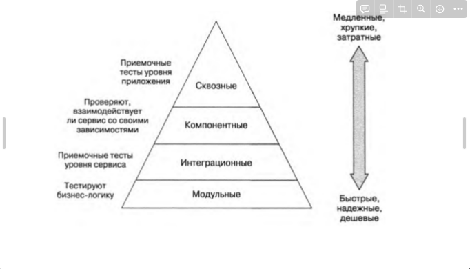

# Урок 12. Принципы тестирования приложений.

[Методичка](https://gbcdn.mrgcdn.ru/uploads/asset/4738587/attachment/b696961458adb364ffeb7a49f1542cc1.pdf)

---

Модель качества является краеугольным камнем системы оценки качества
продукта. Модель качества определяет, какие характеристики качества будут
приниматься во внимание при оценке свойств программного продукта.

Надёжность — степень того, насколько пользователи могут положиться на
продукт или сервис для решения своих задач. Распределённый продукт или
сервис считается надёжным, если он продолжает функционировать, даже когда
один или несколько её программных или аппаратных компонентов выходят из
строя.

Отказ — неспособность узла, компонента или системы выполнять свои функции

Независимые и коррелированные отказы

Устойчивость — способность продукта или сервиса соответствовать заявленным
характеристикам в процессе использования. Это значит, что система не просто
готова к эксплуатации: благодаря дополнительным мощностям,
предусмотренным в ходе проектирования, она может продолжать работать под
нагрузкой, как и ожидают пользователи.

Если сервис готов к работе, но при этом отклоняется от заявленных
характеристик в процессе использования, значит, не хватает устойчивости.

Доступность в широком смысле можно трактовать как гарантию
безотказной работы в течение определённого времени. В свою очередь,
устойчивость определяет качество этой работы, то есть гарантирует
максимально эффективное сохранение функциональности и возможности
взаимодействовать с пользователем в неблагоприятных условиях.

Если сервис не способен безотказно работать по требованию, значит, ему не
хватает доступности. А если он готов к работе, но при этом отклоняется от
заявленных характеристик в процессе использования, значит, не хватает
устойчивости.

### Защитное программирование

Проверяйте все данные из внешних источников
Получив данные из файла, от пользователя, из сети или любого другого внешнего
интерфейса, удостоверьтесь, что все значения попадают в допустимый интервал.
Проверьте, что числовые данные имеют разрешённые значения, а строки
достаточно коротки, чтобы их можно было обработать. Если строка должна
содержать определённый набор значений (скажем, идентификатор финансовой
транзакции или что-то подобное), проконтролируйте, что это значение допустимо
в данном случае, если же нет – отклоните его. Если вы работаете над
приложением, требующим соблюдения безопасности, будьте особенно
осмотрительны с данными, которые могут атаковать вашу систему: попыткам
переполнения буфера, внедрённым SQL-командам, внедрённому HTML- или
XML-коду, переполнения целых чисел, данным передаваемым системным
вызовам и т. п.

Верификация — это процесс проверки того, что программное обеспечение
достигает своей цели без каких-либо ошибок. Это процесс, позволяющий
убедиться в том, что разработанный продукт правильный или нет. Он проверяет,
соответствует ли разработанный продукт требованиям, которые мы
предъявляем.

Валидация — это процесс проверки соответствия программного продукта
требованиям или, другими словами, соответствия продукта требованиям
высокого уровня. Это процесс проверки валидности продукта, т. е. проверка того,
что мы разрабатываем правильный продукт. Это проверка фактического и
ожидаемого продукта.

Регрессионное тестирование — это вид тестирования направленный на
проверку изменений, сделанных в приложении или окружающей среде (починка
дефекта, слияние кода, миграция на другую операционную систему, базу данных,
веб-сервер или сервер приложения), для подтверждения того факта, что
существующая ранее функциональность работает, как и прежде.
Регрессионными могут быть как функциональные, так и нефункциональные
тесты.

Пентесты
Тестирование на проникновение (также называемое пентестингом или
пен-тестом) — это тестирование кибербезопасности, в ходе которого эксперт по
тестированию безопасности, называемый пентестером, выявляет и проверяет
реальные уязвимости, имитируя действия квалифицированного участника
угрозы, решившего получить привилегированный доступ к ИТ-системе или
приложению.

Профилирование — сбор характеристик работы программы, таких как время
выполнения отдельных фрагментов (обычно подпрограмм), число верно
предсказанных условных переходов, число кэш-промахов и т. д. Инструмент,
используемый для анализа работы, называют профилировщиком или
профайлером (profiler). Обычно выполняется совместно с оптимизацией
программы.

Фаззинг — техника тестирования программного обеспечения, часто
автоматическая или полуавтоматическая, заключающая в передаче приложению
на вход неправильных, неожиданных или случайных данных. Предметом
интереса являются падения и зависания, нарушения внутренней логики и
проверок в коде приложения, утечки памяти, вызванные такими данными на
входе.

### Градация серьёзности дефекта (Severity)

Блокирующая (Blocker)
Блокирующая ошибка, приводящая приложение в нерабочее состояние, в
результате которого дальнейшая работа с тестируемой системой или её
ключевыми функциями становится невозможна. Решение проблемы необходимо
для дальнейшего функционирования системы.

Критическая (Critical)
Критическая ошибка, неправильно работающая ключевая бизнес-логика, дыра в
системе безопасности, проблема, приведшая к временному падению сервера или
приводящая в нерабочее состояние некоторую часть системы, без возможности
решения проблемы, используя другие входные точки. Решение проблемы
необходимо для дальнейшей работы с ключевыми функциями тестируемой
системой.

Значительная (Major)
Значительная ошибка, часть основной бизнес-логики работает некорректно.
Ошибка не критична или есть возможность для работы с тестируемой функцией,
используя другие входные точки.

Незначительная (Minor)
Незначительная ошибка, не нарушающая бизнес логику тестируемой части
приложения, очевидная проблема пользовательского интерфейса.

Обычная/Тривиальная (Trivial)
Тривиальная ошибка, не касающаяся бизнес-логики приложения, плохо
воспроизводимая проблема, малозаметная посредствам пользовательского
интерфейса, проблема сторонних библиотек или сервисов, проблема, не
оказывающая никакого влияния на общее качество продукта.