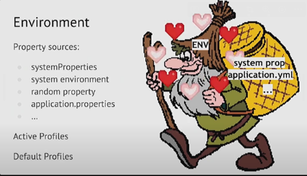
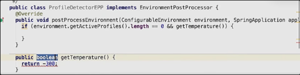
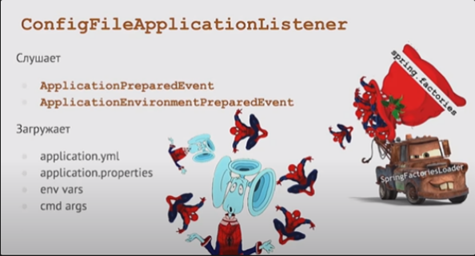
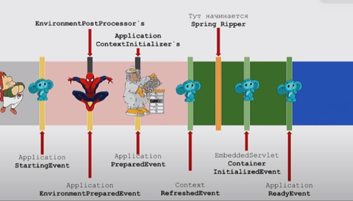

# 2.Основы Spring. Spring Boot.

[Методичка](https://gbcdn.mrgcdn.ru/uploads/asset/5643780/attachment/d54a4f15a0a02093e2f5c28a5180d5ab.pdf)

[Spring-потрошитель 1](https://www.notion.so/Spring-1-2cee0a61f7b443109cd4b4aa8fbc6f1e?pvs=21)

[Время жизни бина](https://habr.com/ru/articles/658273/)

**DI (Dependency Injection)** - это процесс, при котором IoC применяется для внедрения зависимостей в объекты. Другими словами, DI предоставляет объектам зависимости, которые им необходимы. Эти концепции позволяют избежать жестких связей между компонентами системы, что делает код более гибким, поддерживаемым и тестируемым.

**IoC (Inversion of Control)**  - делегированное (фреймворку) конфигурирование компонентов приложений и управление жизненным циклом Java-объектов

Внедрять зависимости в Spring приложении можно тремя способами:

1. В конструкторе. Самый лучший и распространённый метод (99%)
2. Через сеттеры. Не лучший вариант. Лучше избегать
3. Через аннотацию `@Autowired` для поля

@Component: 

Это общая аннотация, которую можно использовать для
определения любого бина. Классы, аннотированные как @Component,
автоматически сканируются Spring и регистрируются в контейнере IoC.

@Repository

Это еще одна специализированная версия @Component,
предназначенная для классов, которые взаимодействуют с системой
хранения данных. Она может интегрироваться с механизмом перехвата
исключений Spring Data Access, который автоматически преобразует
исключения хранилища данных в исключения Spring DataAccessException.

@Controller

Это специализированная версия @Component, предназначенная
для классов, которые обрабатывают HTTP-запросы в веб-приложениях Spring
MVC или Spring WebFlux.

@Configuration

Эта аннотация используется для классов, которые определяют бины с помощью методов @Bean. Эти классы играют роль источников определения бинов для контейнера IoC.

@Bean

Эта аннотация используется вместе с @Configuration для определения бинов. Методы, аннотированные как @Bean, создают объекты, которые управляются Spring и добавляются в контейнер IoC как  бин.

## Типы бинов

В Spring Framework существует несколько типов бинов, основанных на их области видимости. Область видимости бина определяет, когда и как создается новый экземпляр бина. В Spring определены следующие области видимости:

Singleton

Это область видимости по умолчанию. Когда бин определен как
Singleton, Spring IoC контейнер создает единственный экземпляр бина, и все
запросы на получение этого бина возвращают один и тот же объект. Это
подходит для бинов, которые не содержат состояния, таких как сервисы или
DAO.

Prototype

Когда бин определен как Prototype, Spring IoC контейнер создает
новый экземпляр бина каждый раз, когда он запрашивается. Это подходит
для бинов, которые содержат состояния и не могут быть использованы
одновременно в разных компонентах или потоках.

Следующие три области видимости применяются только в веб- приложениях. 

Request 

создается для каждого HTTP-запроса. 

Session создается для каждого HTTP-сеанса. 

Application 

связан с жизненным циклом ServletContext и обычно используется для хранения данных на уровне приложения.

WebSocket

Эта область видимости доступна для бинов, которые должны быть
связаны с жизненным циклом WebSocket.

Для определения области видимости бина в Spring, вы можете использовать
аннотацию @Scope. Например:

```java
@Component
@Scope("prototype")
public class PrototypeBean {
// ...
}

/* В этом примере PrototypeBean будет создаваться каждый раз,
когда он запрашивается из Spring контейнера.
*/
```

Spring Framework имеет две основные реализации контейнера:

BeanFactory

Это базовый контейнер, который предоставляет функциональность IoC. Он определяет основной контракт, который должны выполнять все контейнеры. BeanFactory использует конфигурацию (XML или Java-based) для создания и управления объектами и их зависимостями. Однако он не предоставляет дополнительных возможностей, таких как интеграция с другими компонентами Spring, поддержка аннотаций и т. д.

ApplicationContext

Это расширение BeanFactory, которое предоставляет дополнительные возможности, такие как интеграция с другими компонентами Spring (например, AOP, Web), поддержка аннотаций и др. ApplicationContext является предпочтительным контейнером для большинства приложений, поскольку он предоставляет более широкий набор функций.

В Spring Boot есть два основных способа конфигурации: через файлы
application.properties:

```bash
server.port=8081
spring.application.name=My Awesome Spring Boot App
```

или application.yml:

```yaml
server:
  port: 8081
  
spring:
  application:
    name: My Awesome Spring Boot Ap
```

 и через Java-код.

Некоторые параметры

server.port: порт, на котором будет работать приложение. По умолчанию
это 8080, но вы можете задать любой другой порт.

[spring.application.name](http://spring.application.name/): имя вашего приложения. Оно может быть полезно для логирования и других вещей.

spring.profiles.active: активные профили Spring. 

logging.level.root: уровень логирования для вашего приложения. Вы можете задать его, например, как INFO, WARN, ERROR или DEBUG.

spring.main.banner-mode: режим баннера при запуске вашего приложения. можно отключить баннер, установив этот параметр в OFF.

### Профили Spring

Профили в Spring Boot - это мощный инструмент, который позволяет разделять конфигурацию приложения на разные части в зависимости от среды, в которой оно работает. Можно иметь разные настройки для разработки, тестирования, стейджинга и производства, и легко переключаться между ними.

Профили работают вместе с файлами конфигурации, такими как
application.properties или application.yml. Вы можете создать отдельные файлы
конфигурации для каждого профиля, добавив имя профиля к имени файла.
Например, application-development.properties для профиля разработки и
application-production.properties для профиля производства

Профили также могут быть использованы внутри вашего Java кода с помощью аннотации @Profile. Это позволяет вам определять разные бины или конфигурации для разных профилей. Например, вы можете иметь разные реализации сервиса для разработки и производства:

```java
@Service
@Profile("development")
public class DevelopmentMyService implements MyService {
// реализация для разработки
}
@Service
@Profile("production")
public class ProductionMyService implements MyService {
// реализация для производства
}
```

### Конфигурация через Java-код

В Spring Boot можно создать классы конфигурации, аннотированные
`@Configuration`, и использовать методы с аннотацией `@Bean` для определения компонентов, которые будут управляться Spring IoC контейнером.

```java
@Configuration
public class AppConfig {
	
	@Bean
	public MyService myService() {
	
		return new MyServiceImpl();
	}
}
```

Подобная конфигурация полезна, когда вам нужно выполнить какую-то
дополнительную настройку для ваших компонентов или когда вы хотите создать
несколько экземпляров одного и того же компонента с разными настройками.

### Автоконфигурация

Автоконфигурация - это механизм, который позволяет Spring Boot автоматически настраивать ваше приложение на основе тех библиотек, которые присутствуют в вашем classpath. Например, если Spring Boot обнаруживает, что в вашем classpath есть библиотека Thymeleaf, он автоматически настроит шаблонизатор Thymeleaf для вас.

### Создание Spring приложения

Для создания используется инструмента под названием Spring Initializr

1. С помощью Web-интерфейса по адесу  [https://start.spring.io](https://start.spring.io/). Нужно установить параметры своего приложения и выбрать необходимые зависимости
2. С помощью IDE

### Web клиент-серверное приложение

Для запуска контроллера нужно в браузере нужно выполнить `localhost:8080/car`


```java
ApplicationContext context = SpringApplication.run(Application.class, args);
// получение контекста

context.getBean() // несколько перегруженных методов для получения объектов

@Data // аннотация lombok, добавляющая в класс геттеры, сеттеры и tostring

@Scope(”singleton”), @Scope(”prototype”) // тип бина

@Scope(ConfigurableListableBeanFactory.SCOPE_SINGLETON) // то же самое

@Primary // бин по умолчанию

@Component("newBeanName") // задаёт новое название бина

@Controller // помечает класс содержащий сервлеты

@RequestMapping(path = "all", method = RequestMethod.GET) 
// http://localhost:8080/all помечает сервлет
@ResponseBody // помечает метод как ответ
// если её нет, то @Controller должен вернуть страницу *.html 
// лежащую в resource

@RestController // пом класс содерж все методы как @ResponseBody

@GetMapping("all") // принимает GET

@GetMapping("all", [consumes = ?], produces = MediaType.TEXT_PLANE) 
// Отобразит только текст 

@Autowired // указание для spring 

@Lazy // указ не создавать сразу. Лучше не использовать

@RestController
@RequestMapping("users") // если перед классом, то
// запрос будет типа // http://localhost:8080/users/all

@GetMapping("{id}") // передаёт в метод аргумент
// при этом нужно добавить @PathVariable перед сигнатурой:
public User getById(@PathVariable long id)

public User getByName(@RequestParam String name)
// http://localhost:8080/users?name=Костя
```

## Spring Boot

https://habr.com/ru/articles/435144/

это полезный проект, целью которого является упрощение создания приложений на основе Spring. Он позволяет наиболее простым способом создать web-приложение, требуя от разработчиков минимум усилий по его настройке и написанию кода

Чтобы ускорить процесс управления зависимостями, Spring Boot неявно упаковывает необходимые сторонние зависимости для каждого типа приложения на основе Spring и предоставляет их разработчику посредством так называемых **starter**-пакетов (spring-boot-starter-web, spring-boot-starter-data-jpa и т.д.)

https://docs.spring.io/spring-boot/docs/current/reference/htmlsingle/#using.build-systems.starters

```xml
<?xml version="1.0" encoding="UTF-8"?>
<project xmlns="http://maven.apache.org/POM/4.0.0"
         xmlns:xsi="http://www.w3.org/2001/XMLSchema-instance"
         xsi:schemaLocation="http://maven.apache.org/POM/4.0.0 http://maven.apache.org/xsd/maven-4.0.0.xsd">
    <modelVersion>4.0.0</modelVersion>
    <groupId>springboot.topjava.ru</groupId>
    <artifactId>SpringBootRestService</artifactId>
    <version>1.0</version>
    <packaging>jar</packaging> // обеспечивает упаковку в jar

    <properties>
        <maven.compiler.source>1.8</maven.compiler.source>
        <maven.compiler.target>1.8</maven.compiler.target>
    </properties>

<!-- Все приложения Spring Boot конфигурируются от spring-boot-starter-parent--> 
    <parent>
        <groupId>org.springframework.boot</groupId>
        <artifactId>spring-boot-starter-parent</artifactId>
        <version>2.1.1.RELEASE</version>
    </parent>

    <dependencies>
        <dependency>
            <groupId>org.springframework.boot</groupId>
            <artifactId>spring-boot-starter-web</artifactId>
        </dependency>
    </dependencies>

    <build>
        <plugins>
            <plugin>
                <groupId>org.springframework.boot</groupId>
                <artifactId>spring-boot-maven-plugin</artifactId>
            </plugin>
        </plugins>
    </build>

</project>
```

## Spring Boot потрошитель

SpringApplication сначала строит Enviroment. Enviroment настраивают постпроцессоры

ApplicationContextInitializer - отрабатывает когда контекст уже создан, но в нём нет ничего кроме Enviroment



EnvironmentPostProcessor - работает до ApplicationContextInitializer





Жизненный цикл при старте приложения

