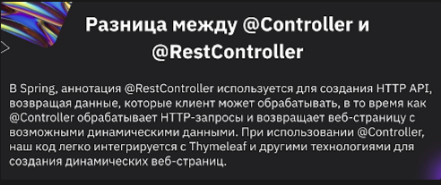

4.Spring MVC Использование шаблонизатора Thymeleaf

[Методичка](https://gbcdn.mrgcdn.ru/uploads/asset/5643786/attachment/b4f5c251948658d664533b8813544c43.pdf)

Spring MVC — Это фреймворк на базе Spring, который предлагает
модель-вид-контроллер (MVC) архитектуру и готовые компоненты, которые могут
быть использованы для разработки гибких и свободно масштабируемых
веб-приложений.

Thymeleaf — Это современный серверный Java-шаблонизатор, способный
обрабатывать как HTML, так и XML. Он хорошо интегрируется с Spring MVC и
обеспечивает полноценную поддержку HTML5.

Контроллер (Controller) — В контексте Spring MVC, контроллер - это класс, который
обрабатывает веб-запросы от клиента. Контроллеры обычно аннотированы
@Controller.

Модель (Model) — Модель представляет собой данные, которые будут отображаться
пользователю. Модель может быть любым Java объектом, который может быть
сохранен в базе данных.

Вид (View) — В Spring MVC вид представляет собой то, что будет отображаться
пользователю. Это может быть JSP-страница, HTML-страница, PDF-документ,
Excel-документ и т.д.

DispatcherServlet — Это сердце Spring MVC, которое обрабатывает входящие
запросы и маршрутизирует их к соответствующим контроллерам.

WebApplicationContext — Специфический для веб-приложений контекст Spring,
который предоставляет конфигурацию для приложения в виде bean-компонентов.
Bean — В контексте Spring, bean это объект, управляемый Spring IoC контейнером.

@RequestMapping — Это аннотация Spring MVC, которая используется для
сопоставления (mapping) веб-запросов с определенными методами обработчика
(контроллеров) в вашем приложении.



Класс, помеченный аннотацией @Controller, подобен @RestController, но с одним
ключевым отличием. Вместо того чтобы просто возвращать данные, @Controller
обрабатывает HTTP-запросы и возвращает имя вида (view), которое затем
используется для генерации HTML-страницы.

 Ресурсы могут включать в себя все: от статических HTML страниц до CSS, JavaScript и изображений. Spring предоставляет удобные инструменты для работы с ними.

Когда мы говорим о статическом контенте в контексте веб-разработки, мы обычно имеем в виду файлы, которые не изменяются динамически на сервере перед тем, как они доставляются клиенту. Это могут быть HTML-файлы, CSS-стили,
JavaScript-скрипты, изображения и так далее. В Spring Boot статические файлы обычно размещаются в директории src/main/resources/static. Все файлы, размещенные в этой  директории, автоматически становятся доступными как статический контент вашего веб-приложения. 

Статические страницы (index.html) кладутся в папку static

```java
// Возвращает index.html, лежащий в static
@Controller
public class HomeController {

	@RequestMapping("/")
	public String home() {
		return "index";
	}
}
```

Важно понимать, что возвращение статической страницы означает, что она будет одинакова для всех пользователей. В отличие от динамической страницы, которая может быть изменена на сервере для каждого запроса (например, для отображения приветствия с именем пользователя), статическая страница остается неизменной.

Шаблоны динамических html страниц кладутся в папку templates

## Thymeleaf

Thymeleaf — современный серверный механизм Java-шаблонов для веб- и автономных сред, способный обрабатывать HTML, XML, JavaScript, CSS и даже простой текст.

[Руководство Habr](https://habr.com/ru/articles/350862/)

Thymeleaf обрабатывает шаблоны и заменяет специальные  Thymeleaf атрибуты и выражения на актуальные данные. Thymeleaf атрибуты обычно начинаются с префикса `th`:, например, `th:text`, `th:if`, `th:each` и так далее.

Чтобы использовать Thymeleaf нужно добавить зависимость в pom.xml

```xml
<dependency>
	<groupId>org.springframework.boot</groupId>
	<artifactId>spring-boot-starter-thymeleaf</artifactId>
</dependency>
```

Объект, который применяет некоторую логику к артефакту разметки (тегу, текст, комментарию) называется  процессором, а набор этих процессоров — плюс, возможно,  некоторые дополнительные артефакты — это то, из чего состоит диалект. Из коробки основная библиотека Thymeleaf предоставляет диалект, называемый стандартным диалектом, которого должно быть достаточно для большинства пользователей.

### Стандарт синтаксиса Выражений/Standard Expression Syntax

Мы уже видели два типа допустимых значений атрибутов, выраженные в этом синтаксисе: сообщения и переменные:

```html
<p th:utext="#{home.welcome}">Welcome to our grocery store!</p>

<p>Today is: <span th:text="${today}">13 february 2011</span></p>
```
Но существует значительно больше выражений. Вот краткий обзор Standard Expression:

- Простые выражения:

	- Переменная: `${...}`

	- Выбранная переменная: `*{...}`

	- Сообщение: `#{...}`

	- Ссылка URL: `@{...}`

	- Фрагмент: `~{...}`

- Литералы/Literals:

	- Текст: `'one text'`, `'Another one!'`,...
	
	- Число: `0`, `34`, `3.0`, `12.3`,...
	
	- Boolean: `true`, `false`
	
	- Null: `null`
 	
	- Токены: `one`, `sometext`, `main`,...

- Текст:

	- Соединение строк: `+`

	- Подстроки: `|The name is ${name}|`

- Арифметика:

	- Binary: `+`, `-`, `*`, `/`, `%`

	- Минус (unary operator): `-`

- Boolean:

	- Binary: `and`, `or`
	
	- Boolean отрицание (unary operator): `!`, `not`

-	Сравнение и равенство:

	- Сравнение: `>`, `<`, `>=`, `<=` (`gt`, `lt`, `ge`, `le`)
	
	- Равенство: `==`, `!=` (`eq`, `ne`)

- Условные:
	
	- If-then: `(if)? (then)`

	- If-then-else: `(if)? (then): (else)`

	- Default: `(value) ?: (defaultvalue)`

- Специальные токены:

	- No-Operation: `_`

Выражения могут комбинироваться и вкладываться:

```
'User is of type ' + (${user.isAdmin()} ? 'Administrator' : (${user.type} ?: 'Unknown'))
```
4.1 Сообщения/Messages


### Примеры

```html
<input type="text" name="userName" value="James Carrot" th:value="${user.name}" />

<!-- атрибут value="James Callot" будет отображаться
 когда прототип будет статически открыт в браузере -->
```


Больше примеров использования th атрибутов в семинаре ([здесь](seminar4.md))