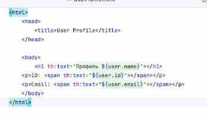
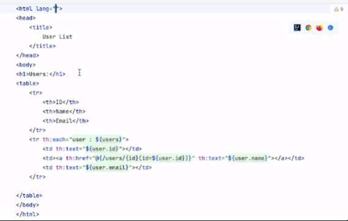
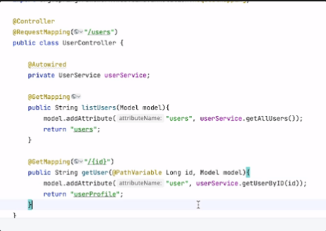
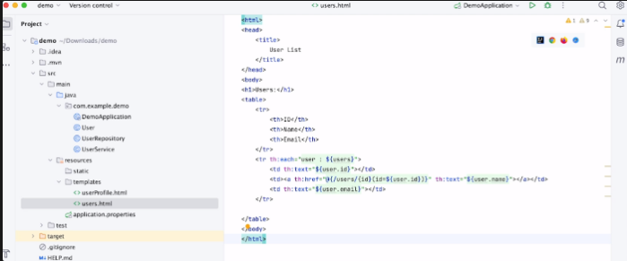

4.Spring MVC Использование шаблонизатора Thymeleaf

[Методичка](https://gbcdn.mrgcdn.ru/uploads/asset/5643786/attachment/b4f5c251948658d664533b8813544c43.pdf)

Spring MVC — Это фреймворк на базе Spring, который предлагает
модель-вид-контроллер (MVC) архитектуру и готовые компоненты, которые могут
быть использованы для разработки гибких и свободно масштабируемых
веб-приложений.

Thymeleaf — Это современный серверный Java-шаблонизатор, способный
обрабатывать как HTML, так и XML. Он хорошо интегрируется с Spring MVC и
обеспечивает полноценную поддержку HTML5.

Контроллер (Controller) — В контексте Spring MVC, контроллер - это класс, который
обрабатывает веб-запросы от клиента. Контроллеры обычно аннотированы
@Controller.

Модель (Model) — Модель представляет собой данные, которые будут отображаться
пользователю. Модель может быть любым Java объектом, который может быть
сохранен в базе данных.

Вид (View) — В Spring MVC вид представляет собой то, что будет отображаться
пользователю. Это может быть JSP-страница, HTML-страница, PDF-документ,
Excel-документ и т.д.

DispatcherServlet — Это сердце Spring MVC, которое обрабатывает входящие
запросы и маршрутизирует их к соответствующим контроллерам.

WebApplicationContext — Специфический для веб-приложений контекст Spring,
который предоставляет конфигурацию для приложения в виде bean-компонентов.
Bean — В контексте Spring, bean это объект, управляемый Spring IoC контейнером.

RequestMapping — Это аннотация Spring MVC, которая используется для
сопоставления (mapping) веб-запросов с определенными методами обработчика
(контроллеров) в вашем приложении.


Класс, помеченный аннотацией @Controller, подобен @RestController, но с одним
ключевым отличием. Вместо того чтобы просто возвращать данные, @Controller
обрабатывает HTTP-запросы и возвращает имя вида (view), которое затем
используется для генерации HTML-страницы.

Статические страницы (index.html) кладутся в папку static

```java
// Возвращает index.html, лежащий в static
@Controller
public class HomeController {

	@RequestMapping("/")
	public String home() {
		return "index";
	}
}
```

Шаблоны динамических html страниц кладутся в папку templates

Пример:

Использование динамических страниц.

Файл userProfile.html



Файл users.html







## Thymeleaf

```html
<input type="text" name="userName" value="James Carrot" th:value="${user.name}" />
// 
```