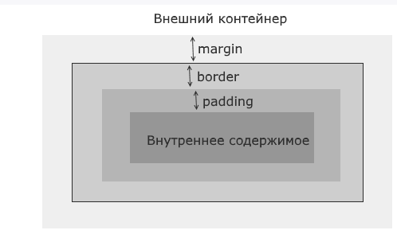

## Блочная модель



Для веб-браузера элементы страницы представляют небольшие контейнеры или блоки. Такие блоки могут иметь различное содержимое - текст, изображения, списки, таблицы и другие элементы. Внутренние элементы блоков сами выступают в качестве блоков.

Пусть элемент расположен в каком-нибудь внешнем контейнере. Это может быть элемент `body`, `div` и так далее. От других элементов он отделяется некоторым расстоянием - внешним отступом, которое описывается свойством CSS `margin`. То есть свойство `margin` определяет расстояние от границы текущего элемента до других соседних элементов или до границ внешнего контейнера.

Далее начинается сам элемент. И в начале идет его граница, которая в CSS описывается свойством `border`.

После границы идет внутренний отступ, который в CSS описывается свойством `padding`. Внутренний отступ определяет расстояние от границы элемента до внутреннего содержимого.

Далее идет внутреннее содержимое, которое также реализует ту же блочную модель и также может состоять из других элементов, которые имеют внешние и внутренние отступы и границу.

```html
<!DOCTYPE html>
<html>
    <head>
        <meta charset="utf-8">
        <title>Блочная модель в CSS3</title>
        <style>
            div{
                margin: 15px; /* внешний отступ */
                padding: 11px; /* внутренний отступ */
                border: 3px solid red; /* границы шириной в 3 пикселя сплошной красной линией */
            }
        </style>
    </head>
    <body>
        <div>
            <p>Первый блок</p>
        </div>
        <div>
            <p>Второй блок</p>
        </div>
    </body>
</html>
```

Свойство `margin` определяет отступ элемента от других элементов или границы внешнего контейнера. Существуют специальные свойства CSS для задания отступов для каждой стороны:

|свойство|назначение|
|-|-|
|margin-top|отступ сверху|
|margin-bottom|отступ снизу|
|margin-left|отступ слева|
|margin-right|отступ справа|

---

```css
div{
    margin-top: 30px; /* отступ сверху */
    margin-left: 25px; /* отступ слева */
    margin-right: 20px; /* отступ справа */
    margin-bottom: 15px; /* отступ снизу */
    /* можно одним свойством: */
    /* margin: 30px 20px 15px 25px;              */
    border: 3px solid red; /* граница */
}
```

Для установки отступов можно использовать точные значения в пикселях (px) или em, либо процентные отношения, либо значение auto (автоматическая установка отступов).

При использовании процентов веб-браузеры вычисляют размер отступов на основе ширины элемента-контейнера, в который заключен стилизуемый элемент.

В то же время, если несколько элементов у нас соприкасаются, то браузер выбирает наибольший отступ элемента, который затем и используется. Так, выше в примере использовался следующий стиль:

Свойство `padding` задает внутренние отступы от границы элемента до его внутреннего содержимого. Как и для свойство margin, в CSS имеются четыре свойства, которые устанавливают отступы для каждой из сторон:

- padding-top

- padding-bottom

- padding-left

- padding-right

---

Для настройки границы могут использоваться сразу несколько свойств:

|свойство|назначение|
|-|-|
|border-width|ширина границы|
|border-style|стиль линии границы|
|border-color|цвет границы|
|border-radius|позволяет округлить границу. Это свойство принимает значение радиуса в пикселях или единицах em.|

---

Свойство `border-width` может принимать следующие типы значений:

- Значения в единицах измерения, таких как em, px или cm

- Одно из константных значений: `thin` (тонкая граница - 1px), `medium` (средняя по ширине - 3px), `thick` (толстая - 5px)

|border-style:||
|-|-|
|none|граница отсутствует|
|solid|граница в виде обычной линии|
|dashed|штриховая линия|
|dotted|линия в виде последовательности точек|
|double|граница в виде двух параллельных линий|
|groove|граница имеет трехмерный эффект|
|inset|граница как бы вдавливается во внутрь|
|outset|аналогично inset, только граница как бы выступает наружу|
|ridge|граница также реализует трехмерный эффект|

---

Для установки границы для отдельных сторон можно использовать одно из свойств:

- border-top

- border-bottom

- border-left

- border-right

---

При необходимости мы можем определить цвет, стиль и ширину границы для каждой из сторон используя следующие свойства:

- border-top-width

- border-top-style

- border-top-color

- border-bottom-width

- .......

---

Так как у элемента может быть максимально черыре угла, можно указать четыре значения для установки радиуса у каждого из углов:

```css
border-radius: 15px 30px 5px 40px
```

Для установки радиусов углов по отдельности используются свойства:

```css
border-top-left-radius: 15px;   /* радиус для верхнего левого угла */
border-top-right-radius: 30px;  /* радиус для верхнего правого угла */
border-bottom-right-radius: 5px;    /* радиус для нижнего левого угла */
border-bottom-left-radius: 40px;    /* радиус для нижнего правого угла */
```

Для создания элиптических углов:

```css
border-radius: 40px/20px;
```
