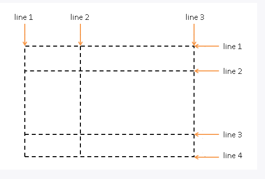

## Grid Layout

Grid Layout  позиционирует элементы сразу в двух направлениях - в виде строк и столбцов, образуя тем самым таблицу.

> Cледует учитывать, что только относительно недавно производители браузеров стали внедрять поддержку этого модуля в свои браузеры. Кроме того, IE (начиная с версии 10) и Microsoft Edge имеет лишь частичную поддержку модуля. А Android Browser, Opera Mini, UC Browser вовсе ее не имеют.

### Создание grid-контейнера

Основой для определения компоновки **Grid Layout** является **grid container**, внутри которого размещаются элементы. Для создания grid-контейнера необходимо присвоить его стилевому свойству `display` одно из двух значений: `grid` или `inline-grid`.

```html
<!DOCTYPE html>
<html>
    <head>
        <meta charset="utf-8">
        <meta name="viewport" content="width=device-width" />
        <title>Grid Layout в CSS3</title>
        <style>
            .grid-container {
                border: solid 2px #000;
                display: grid;
            }
            .grid-item {
                text-align:center;
                font-size: 1.1em;
                padding: 1.5em;
                color: white;
            }
 
            .color1 {background-color: #675BA7;}
            .color2 {background-color: #9BC850;}
            .color3 {background-color: #A62E5C;}
            .color4 {background-color: #2A9FBC;}
        </style>
    </head>
    <body>
        <div class="grid-container">
            <div class="grid-item color1">Grid Item 1</div>
            <div class="grid-item color2">Grid Item 2</div>
            <div class="grid-item color3">Grid Item 3</div>
            <div class="grid-item color4">Grid Item 4</div>
            <div class="grid-item color1">Grid Item 5</div>
        </div>
    </body>
</html>
```

Если значение `grid` определяет контейнер как блочный элемент, то значение `inline-grid` определяет элемент как строчный (`inline`).

В этом случае весь грид занимает только то пространство, которое необходимо для размещения его элементов.

### Строки и столбцы

Грид образует сетку из строк и столбцов, на пересечении которых образуются ячейки. И для установки строк и столбцов в Grid Layout использовать следующие свойства CSS3:

|свойство|назначение|
|-|-|
|grid-template-columns|настраивает столбцы|
|grid-template-rows|настраивает строки|

 В качестве значения свойству `grid-template-columns` передается ширина столбцов. Сколько мы хотим иметь в гриде столбцов, столько и нужно передать значений этому свойству.

```css
grid-template-columns: 8em 7em 8em;
```

Для настройки строк у грид-контейнера необходимо установить свойство `grid-template-rows`, которое задает количество и высоту строк:

```css
grid-template-rows: 4em 5em;
```

> Если элементов больше, чем ячеек грида, то образуются дополнительные строки (как в случае со столбцами). Высота дополнительной ячейки будет вычисляться автоматически.

### Функция `repeat`

```css
grid-template-columns: repeat(3, 8em);
grid-template-rows: repeat(4, 5em);
/* Первый параметр функции repeat представляет число повторений, а второй - определение строк или столбцов. */
```

Можно задавать повторение нескольких столбцов и строк:

```css
.grid-container {
    border: solid 2px #000;
    display: grid;
    grid-template-columns: repeat(2, 7em 8em);
    /* будет создано 4 столбца: два раза будут повторяться два столбца с шириной 7em и 8em. */
    grid-template-rows: 6em repeat(3, 5em);
    /* будет сздано 4 строки. Причем первая будет иметь высоту в 6em, а остальные три - 5em.*/
}
```

### Свойство `grid`

Объединяет два свойства и имеет следующий формат:

```css
grid: grid-template-rows / grid-template-columns;
```

Например так:

```css
grid: repeat(4, 5em) / repeat(3, 8em);
```

### Размеры строк и столбцов

- **Фиксированные размеры**

Задаются с помощью свойств `grid-template-columns` и `grid-template-rows`.

- **Автоматические размеры**

Задаются с помощью ключевого слова `auto`. В этом случае ширина столбцов и высота строк вычисляются исходя из размеров содержимого

```css
grid-template-columns: 8em auto auto;
grid-template-rows: auto 4.5em auto;
```

- **Пропорциональные размеры**

Для установки пропорциональных размеров применяется специальная единица измерения `fr`. Она представляет собой часть пространства (fraction), которое отводится для данного столбца или строки. Значение `fr` еще называют flex-фактором (flex factor).

Вычисление пропорциональных размеров производится по формуле:

```
flex-фактор * доступное_пространство  / сумма всех flex-факторов
```
При этом под доступным пространством понимается все пространство grid-контейнера за исключением фиксированных значений строк и столбцов.

```css
grid-template-columns: 8em 2fr 1fr;
grid-template-rows: 1fr 4.5em 1fr;
```

### Отступы между столбцами и строками

Для создания отступов между столбцами и строками применяются свойства `grid-column-gap` и `grid-row-gap` соответственно.

```css
grid-column-gap: 10px;
grid-row-gap: 10px;
```

Если значения свойств `grid-column-gap` и `grid-row-gap` совпадают, то вместо них можно определить одно свойство `gap` (ранее назвалось `grid-gap`), которое установит оба отступа:

```css
gap: 10px;
```

### Позиционирование элементов

Грид представляет собой набор ячеек, которые образуются на пересечении столбцов и строк. Но сами строки и столбцы образуются с помощью grid-линий, которые рассекают грид по вертикали и горизонтали:



По умолчанию каждый элемент в гриде позиционируется в одну ячейку по порядку. Для более точного расположения элемента предназначены свойства:

|свойство|назначение|
|-|-|
|grid-row-start|задает начальную горизонтальную grid-линию, с которой начинается элемент|
|grid-row-end|указывает, до какой горизонтальной grid-линии надо растягивать элемент|
|grid-row|определяет два свойства `grid-row: grid-row-start / grid-row-end;`|
|grid-column-start|задает начальную вертикальную grid-линию, от которой начинается элемент|
|grid-column-end|указывает, до какой вертикальной grid-линии нужно растягивать элемент|
|grid-column|определяет два свойства`grid-column: grid-column-start / grid-column-end;`|
|span|задаёт растяжение на несколько ячеек|
|grid-area| объединяет свойства `grid-area: row-start / column-start / row-end / column-end`|

Например, растянем элемент на несколько столбцов:

```css
<!DOCTYPE html>
<html>
    <head>
        <meta charset="utf-8">
        <meta name="viewport" content="width=device-width" />
        <title>Grid Layout в CSS3</title>
        <style>
            .grid-container {
                border: solid 2px #000;
                display: grid;
                grid-template-columns: repeat(4, 1fr);
                grid-template-rows: repeat(3, 5em);
            }
            .special-item{
                grid-column-start:2;
                grid-column-end: 5;
            }
            .grid-item {
                text-align:center;
                font-size: 1.1em;
                padding: 1.5em;
                color: white;
            }
            .color1 {background-color: #675BA7;}
            .color2 {background-color: #9BC850;}
            .color3 {background-color: #A62E5C;}
            .color4 {background-color: #2A9FBC;}
            .color5 {background-color: #4e342e;}
        </style>
    </head>
    <body>
        <div class="grid-container">
            <div class="grid-item color1">Grid Item 1</div>
            <div class="grid-item color2 special-item">Grid Item 2</div>
            <div class="grid-item color3">Grid Item 3</div>
            <div class="grid-item color4">Grid Item 4</div>
            <div class="grid-item color5">Grid Item 5</div>
            <div class="grid-item color1">Grid Item 6</div>
            <div class="grid-item color4">Grid Item 7</div>
        </div>
    </body>
</html>
```

- **span**

С помощью специального слова span можно задать растяжение элемента на несколько ячеек. После слова span указывается, на какое количество ячеек надо растянуть элемент:

```css
.special-item{
    grid-row: 1 / span 2;
    grid-column: 2 / span 2;
}
```

Элемент помещается в ячейку, которая находится на пересечении первой строки и второго столбца, и растягивается на две строки вниз и на два столбца вправо.

