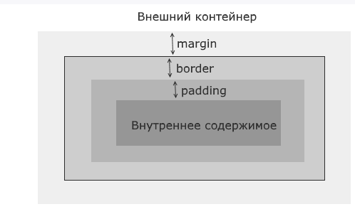

# CSS Каскадные таблицы стилей

## Селекторы

**Селектор** это конструкция, которая показывает к каким тегам будет применено **CSS правило**

```css
strong {
    color: red;
}
```

[Селекторы CSS](https://html5css.ru/cssref/css_selectors.php)

[Свойства CSS](https://html5css.ru/cssref/default.php)

---

Стили для элементов HTML-документа могут быть заданы различным способом:

- <span style="color:yellow;"><b>Встроенные</b></span>. Для любого элемента в начальном теге:

```html
<p style="background-color:lightblue;color:white;text-align:center;">Hello World</p>

```

- <span style="color:yellow;"><b>Внутренние</b></span>. Для каждой страницы в разделе <head> в секции <style></style>

```html
<head>
    <style>
        p {
            background-color: lightblue;
            color: white;
            text-align: center;
        }
    </style>
</head>

```

- <span style="color:yellow;"><b>Внешние</b></span>. Стили описываются в файлах *.css, которые подключаются в теле заголовка в теге <link>

```html
<head>
  <link rel="stylesheet" type="text/css" href="styles.css">
</head>
```

CSS-файл это текстовый файл, в котором для каждого селектора определяется массив `свойство: значение`

```css
h1 {
    color: blue;
    font-family: verdana;
    font-size: 300%;
}
p  {
    color: red;
    font-family: courier;
    font-size: 160%;
}
```


Если некоторые свойства были определены для одного и того же селектора (элемента) в разных таблицах стилей, будет использовано значение из последней таблицы стилей чтения.

Для определения стиля к элементу могут применяться различные селекторы, и важность каждого селектора оценивается в баллах. Чем больше у селектора пунктов, тем он важнее, и тем больший приоритет его стили имеют над стилями других селекторов. Если селектор является составным, то происходит сложение баллов всех входящих в селектор подселекторов.

|Важность|Селекторы|
|-|-|
|1|Селекторы тегов|
|10|Селекторы классов, атрибутов и псевдоклассов|
|100|Селекторы идентификаторов|
|1000|Встроенные inline-стили (задаваемые через атрибут style)|

CSS предоставляет возможность полностью отменить значимость стилей. Для этого в конце стиля указывается значение `!important`:

```css
a {font-size: 18px; color: red !important;}
#menu a {color: navy;}
```

В этом случае вне зависимости от наличия других селекторов с большим количеством баллов к ссылкам будет применяться красный цвет, определяемый первым стилем.

---

Свойства, определённые для родительского тега, наследуются потомками.

```css
/* выберет все теги p, которые расположены внутри div на первом уровне */
div > p {
    font-style: italic;
}

/* Выберет всех потомков div */
div p {
    font-style: italic;
}
```


## Псевдоклассы

В дополнение к селекторам тегов, классов и идентификаторов нам доступны селекторы псевдоклассов, которые несут дополнительные возможности по выбору нужных элементов.

|Псевдокласс|Назначение|
|-|-|
|:link|применяется к ссылкам и представляет ссылку в обычном состоянии, по которой еще не совершен переход|
|:visited|представляет ссылку, по которой пользователь уже переходил|
|:active|представляет ссылку в тот момент, когда пользователь осуществляет по ней переход|
|:hover|представляет элемент, на который пользователь навел указатель мыши. Применяется преимущественно к ссылкам, однако может также применяться и к другим элементам, например, к параграфам|
|:focus|представляет элемент, который получает фокус, то есть когда пользователь нажимает клавишу табуляции или нажимает кнопкой мыши на поле ввода (например, текстовое поле)|
|:is|применяется для сокращения длинных селекторов. Функция псевдокласса `:is()` принимает список селекторов для выбора элементов html.|
|:where|работает подобно `:is()`, он также принимает набор селекторов и выбирает все соответстующие селекторы.|

---

> Псевдокласс :is() применяет каскадность стилей (selector specificity), которая определяется по селектору с самым большим рангом. А для стилей псевдокласса :where() ранг селекторов всегда равен 0.

    
```html
    <!DOCTYPE html>
<html>
    <head>
        <meta charset="utf-8">
        <title>Псевдоклассы в CSS3</title>
        <style>
            a:link    {color:blue; text-decoration:none}
            a:visited {color:pink; text-decoration:none}
            a:hover   {color:red; text-decoration:underline}
            a:active  {color:yellow; text-decoration:underline}
            input:hover {border:2px solid red;}
        </style>
    </head>
    <body>
        <a href="index.html">Учебник по CSS3</a>
        <input type="text" />
    </body>
</html>
```

```css
    /* header > p, main > p, footer > p {font-size: 18px; font-family: Verdana;} альтернативный вариант без :is*/
    :is(header, main, footer) > p  {font-size: 18px; font-family: Verdana;}
    :where(header, main, footer) > p  {font-size: 18px; font-family: Verdana;}
```

## Псевдоэлементы

Псевдоэлементы обладают рядом дополнительных возможностей по выбору элементов веб-страницы и похожи на псевдоклассы. Список доступных псевдоэлементов:

|Псевдоэлемент|Назначение|
|-|-|
|::first-letter|позволяет выбрать первую букву из текста|
|::first-line| стилизует первую строку текста|
|::before|добавляет сообщение до определенного элемента|
|::after|добавляет сообщение после определенного элемента|
|::selection|выбирает выбранные пользователем элементы|

```html
<!DOCTYPE html>
<html>
    <head>
        <meta charset="utf-8">
        <title>Псевдоклассы в CSS3</title>
        <style>
            .warning::before{ content: "Важно! "; font-weight: bold; }
            .warning::after { content: " Будьте осторожны!"; font-weight: bold;}
        </style>
    </head>
    <body>
        <p><span class="warning">Не пытайтесь засунуть язык в электрическую розетку.</span></p>
    </body>
</html>
```

## Селекторы атрибутов

> Применяются не только к элементам, но и к классам и идентификаторам

```css
input[type="text"]{
     
    border: 2px solid red;
}
/* в скобках значение атрибута */
```

Специальные символы позволяют конкретизировать значение атрибута:

|Символ|Предназначение|
|-|-|
|^|позволяет выбрать все атрибуты, которые начинаются на определенный текст|
|$|позволяет выбрать все атрибуты, которые заканчиваются определённым текстом|
|*|позволяет выбрать все элементы с атрибутами, которые в своем значении имеют определенный текст (не важно где - в начале, середине или конце)|

---

```css
a[href^="https://"]{
             
    color: red;
}

img[src$=".jpg"]{
             
    width: 100px;
}

a[href*="microsoft"]{
             
    color: red;
}
```

---

## Свойства текста

|свойство|назначение|
|-|-|
|font-size|размер шрифта|
|font-weight|жирность начертания (число, кратное 100 от 100 до 900)|
|font-style|стиль начертания (italic, bold, normal, oblique)|
|color|цвет текста|
|font-family|гарнитура шрифта (serif, sans-serif, arial)|
|line-height|междустрочный интервал|
|text-decoration|подчёркнутый, надчёркнутый, перечёркнутый (underline, overline, line-throught)|
|text-transform|заглавные, строчные (uppercase, lowercase)|
|text-align|выравнивание текста (left, right, center, justify-по ширине)|
|text-indent|задаёт отступ первой строки обзаца в `em` или `px`|
|text-shadow|создаёт тени для текста|

---

```css
h1 {
    text-shadow: 5px 4px 3px #999;
    /* гор_смещение верт_смещение степень_размытости цвет_тени */
}
```

---

## Свойства списков

- list-style-type - тип маркера
    
    - неупорядоченные списки
    
        - disc
    
        - circle
    
        - square
    
    - нумерованные списки
    
        - decimal - арабские
    
        - lower-roman - стр. римские
    
        - upper-roman - загл. римские
    
        - lower-alpha - стр. латинские буквы
    
        - upper-alpha- загл. латинские буквы

- list-style-image - устанавливает любую картинку

    ```css
    list-style-image: url("images/image.png")
    ```

- list-stile-position - положение маркера списка

    - outside - положение снаружи (по умолчанию)
    - inside - внутри

---

## Стилизация таблиц

|свойство|назначение|
|-|-|
|border|устанавливает толщину, тип и цвет границ|
|border-collapse| устанавливает, как будет стилизоваться граница смежных ячеек|
|border-spacing|устанавливает промежутки между границами смежных ячеек, если смежные ячейки имеют раздельные границы|
|caption-side|устанавливает положение элемента caption|
|empty-sells|задает режим отрисовки для пустых ячеек|
|table-layout|определяет размеры таблицы|
|vertical-align|определяет вертикальное содержимое ячеек. Применяется только к элементам `<th>` и `<td>`|

---

```css
table {
    border: 1px solid #ccc;  /* граница всей таблицы */
}
tr {
    border: 1px solid #ccc;  /* границы между строками */
}
td, th {
    border: 1px solid #ccc;  /* границы между столбцами */
}
```

|border-collapse:|результат|
|- |-|
|collapse|смежные ячейки имеют общую границу|
|separate|смежные ячейки имеют отдельные границы, которые разделяются пространством|

---

|empty-cells:|результат|
|-|-|
|show|пустые ячейки отображаются, значение по умолчанию|
|hide|пустые ячейки не отображаются|

---

|caption-side:|результат|
|-|-|
|top|позиционирование заголовка вверху (значение по умолчанию)|
|bottom|позиционирование заголовка внизу|

---

|table-layout:|результат|
|-|-|
|auto|браузер устанавливает ширину столбцов автоматически, исходя из ширины самой широкой ячейки в столбце. А из ширины отдельных столбцов складывается ширина всей таблицы (по умолчанию)|
|fixed|позволяет установить фиксированную ширину|

```css
table {
    border: 1px solid #ccc;
    border-spacing: 3px;
    table-layout: fixed;
    width:350px; 
}
```

|vertical-align|результат|
|-|-|
|top|выравнивание содержимого по верху ячейки|
|baseline|выравнивание первой строки текста по верху ячейки|
|middle|выравнивание по центру (значение по умолчанию)|
|bottom|выравнивание по низу|

---

## Цвет в CSS

Цвет можно задать следующими способами:

- в виде 16-ричного кода

    ```css
    color: #000000;
    color: #ffffff;
    color: #ff00ff;
    ```

- в rgb-формате, воспользовавшись функцией rgb(r, g, b)

    ```css
    color: rgb(0, 0, 0);
    ```
- в rgba-формате, задав прозрачность (0.0 - 1.0)

    ```css
    color: rgba(0, 0, 0, 0.5);
    color: rgba(255, 0, 255, 0.2);
    ```

---

## Блочная модель



Для веб-браузера элементы страницы представляют небольшие контейнеры или блоки. Такие блоки могут иметь различное содержимое - текст, изображения, списки, таблицы и другие элементы. Внутренние элементы блоков сами выступают в качестве блоков.

Пусть элемент расположен в каком-нибудь внешнем контейнере. Это может быть элемент `body`, `div` и так далее. От других элементов он отделяется некоторым расстоянием - внешним отступом, которое описывается свойством CSS `margin`. То есть свойство `margin` определяет расстояние от границы текущего элемента до других соседних элементов или до границ внешнего контейнера.

Далее начинается сам элемент. И в начале идет его граница, которая в CSS описывается свойством `border`.

После границы идет внутренний отступ, который в CSS описывается свойством `padding`. Внутренний отступ определяет расстояние от границы элемента до внутреннего содержимого.

Далее идет внутреннее содержимое, которое также реализует ту же блочную модель и также может состоять из других элементов, которые имеют внешние и внутренние отступы и границу.

```html
<!DOCTYPE html>
<html>
    <head>
        <meta charset="utf-8">
        <title>Блочная модель в CSS3</title>
        <style>
            div{
                margin: 15px; /* внешний отступ */
                padding: 11px; /* внутренний отступ */
                border: 3px solid red; /* границы шириной в 3 пикселя сплошной красной линией */
            }
        </style>
    </head>
    <body>
        <div>
            <p>Первый блок</p>
        </div>
        <div>
            <p>Второй блок</p>
        </div>
    </body>
</html>
```

Свойство `margin` определяет отступ элемента от других элементов или границы внешнего контейнера. Существуют специальные свойства CSS для задания отступов для каждой стороны:

|свойство|назначение|
|-|-|
|margin-top|отступ сверху|
|margin-bottom|отступ снизу|
|margin-left|отступ слева|
|margin-right|отступ справа|

---

```css
div{
    margin-top: 30px; /* отступ сверху */
    margin-left: 25px; /* отступ слева */
    margin-right: 20px; /* отступ справа */
    margin-bottom: 15px; /* отступ снизу */
    /* можно одним свойством: */
    /* margin: 30px 20px 15px 25px;              */
    border: 3px solid red; /* граница */
}
```

Для установки отступов можно использовать точные значения в пикселях (px) или em, либо процентные отношения, либо значение auto (автоматическая установка отступов).

При использовании процентов веб-браузеры вычисляют размер отступов на основе ширины элемента-контейнера, в который заключен стилизуемый элемент.

В то же время, если несколько элементов у нас соприкасаются, то браузер выбирает наибольший отступ элемента, который затем и используется. Так, выше в примере использовался следующий стиль:

Свойство `padding` задает внутренние отступы от границы элемента до его внутреннего содержимого. Как и для свойство margin, в CSS имеются четыре свойства, которые устанавливают отступы для каждой из сторон:

- padding-top

- padding-bottom

- padding-left

- padding-right

---

Для настройки границы могут использоваться сразу несколько свойств:

|свойство|назначение|
|-|-|
|border-width|ширина границы|
|border-style|стиль линии границы|
|border-color|цвет границы|
|border-radius|позволяет округлить границу. Это свойство принимает значение радиуса в пикселях или единицах em.|

---

Свойство `border-width` может принимать следующие типы значений:

- Значения в единицах измерения, таких как em, px или cm

- Одно из константных значений: `thin` (тонкая граница - 1px), `medium` (средняя по ширине - 3px), `thick` (толстая - 5px)

|border-style:||
|-|-|
|none|граница отсутствует|
|solid|граница в виде обычной линии|
|dashed|штриховая линия|
|dotted|линия в виде последовательности точек|
|double|граница в виде двух параллельных линий|
|groove|граница имеет трехмерный эффект|
|inset|граница как бы вдавливается во внутрь|
|outset|аналогично inset, только граница как бы выступает наружу|
|ridge|граница также реализует трехмерный эффект|

---

Для установки границы для отдельных сторон можно использовать одно из свойств:

- border-top

- border-bottom

- border-left

- border-right

---

При необходимости мы можем определить цвет, стиль и ширину границы для каждой из сторон используя следующие свойства:

- border-top-width

- border-top-style

- border-top-color

- border-bottom-width

- .......

---

Так как у элемента может быть максимально черыре угла, можно указать четыре значения для установки радиуса у каждого из углов:

```css
border-radius: 15px 30px 5px 40px
```

Для установки радиусов углов по отдельности используются свойства:

```css
border-top-left-radius: 15px;   /* радиус для верхнего левого угла */
border-top-right-radius: 30px;  /* радиус для верхнего правого угла */
border-bottom-right-radius: 5px;    /* радиус для нижнего левого угла */
border-bottom-left-radius: 40px;    /* радиус для нижнего правого угла */
```

Для создания элиптических углов:

```css
border-radius: 40px/20px;
```

## Размеры элементов

### Единицы измерения

Значение по умолчанию для этих свойств - auto, то есть браузер сам определяет ширину и высоту элемента. Можно также явно задать размеры с помощью единиц измерения (пикселей, em) или с помощью процентов:

|единица|значение|
|-|-|
|px|пиксель, минимальная точка экрана|
|em|размер шрифта родителя|
|rem|размер относительно размера шрифта элемента `<html>` (не поддерживается IE8-)|
|%|размер относительно того же свойства родителя или контейнера|

---

Для поддержки мобильных устройств были созданы размеры относительно экрана (кроме IE8-)

|единица|значение|
|-|-|
|vw|1% ширины окна|
|vh|1% высоты окна|
|vmin|наименьшее из (vw, vh), в IE9 обозначается vm|
|vmax|наибольшее из (vw, vh)|

---

Размеры элементов задаются с помощью свойств `width` (ширина) и `height` (высота). Значение по умолчанию для этих свойств - `auto`, то есть браузер сам определяет ширину и высоту элемента. 

Следует помнить что `width` определяет ширину  внутреннего содержимого элемента, а под блок самого элемента будет выделяться пространство, ширина которого равна ширине внутреннего содержимого (свойство `width`) + внутренние отступы (свойство `padding`) + ширина границы (свойство `border-width`) + внешние отступы (свойство `margin`). 

С помощью дополнительного набора свойств можно установить минимальные и максимальные размеры:

|свойство|назначение|
|-|-|
|min-width|минимальная ширина|
|max-width|максимальная ширина|
|min-height|минимальная высота|
|max-height|максимальная высота|

```css
min-width: 200px;
width:50%;
max-width: 300px;
/* В данном случае ширина элемента равна 50% ширины элемента-контейнера, однако при этом не может быть меньше 200 пикселей и больше 300 пикселей.
 */
```

### Переопределение ширины блока

Свойство `box-sizing` позволяет переопределить установленные размеры элементов. Оно может принимать одно из следующих значений:

|box-sizing:|результат|
|-|-|
|content-box|начение свойства по умолчанию, при котором браузер для определения реальных ширины и высоты элементов берет соответственно значения свойств `width` и `height` элемента|
|padding-box|указывает веб-браузеру, что ширина и высота элемента должны включать внутренние отступы как часть своего значения. (большинство современных браузеров не поддерживают данное свойство.)|
|border-box|указывает веб-браузеру, что ширина и высота элемента должны включать внутренние отступы и границы как часть своего значения.|

---

## Свойства фоновых изображений элемента

- `backgraund-color` - цвет фона

- `background-image` - фоновое изображение

    ```css
    background-image: url(images/image.jpg);
    ```
- `background-size` - устанавливает размер фонового изображения либо единицы измерения, либо одно из предустановленных значений:

    - `contain` - масштабирует изображение по наибольшей стороне, сохраняя аспектное отношение

    - `cover` - масштабирует изображение по наименьшей стороне, сохраняя аспектное отношение

    - `auto` - значение по умолчанию, изображение отображается в полный размер

Можно задать точное значение для одного измерения - ширины или высоты, а для другого задать автоматические размеры, чтобы браузер сам выводил точные значения:

```css
background-size: 200px auto;
```

- `background-attachment` - устанавливает стиль прикрепления фонового изображения к элементу:

    - `fixed` - фон элемента фиксирован вне зависимости от прокрутки внутри элемента

    - `local` - по мере прокрутки внутри элемента фон изменяется

    - `scroll` - фон фиксирован и не меняется при прокрутке, но в отличие от fixed несколько элементов могут использовать свой фон, тогда как при fixed создается один фон для всех элементов

- `background-origin` - устанавливает начальную позицию фонового изображения

    - `border-box` - он у элемента устанавливается начиная с его внешней границы, определяемой свойством `border`

    - `padding-box` - устанавливается с учетом внутренних отступов

    - `content-box` - фон устанавливается по содержимому элемента

- `background-clip` - определяет, какая часть изображения используется для фона

    - `border-box` - изображение обрезается по границам элемента

    - `padding-box` - из изображения исключается та часть, которая находится под границами элемента

    - `content-box` - изображение обрезается по содержимому с учетом внутренних отступов

- `backgraund-repeat` - повторение изображения
    
    - `no-repeat` - не повторяется
    
    - `repeat-x` - повторение по горизонтали

    - `repeat-y` - повторение по вертикали

    - `repeat` - повторение по обеим сторонам (по умолчанию)

    - `space` - изображение повторяется для заполнения всей поверхности элемента, но без создания фрагментов

    - `round` - изображение должным образом масштабируется для полного заполнения всего пространства

- `background-position` - положение фонового изображения внутри элемента. Оно может принимать отступы от верхнего левого угла элемента в единицах измерения, например, в пикселях в следующем формате:

    ```css
    background-position: отступ_по_оси_X отступ_по_оси_Y;   

    ```

    Кроме того, данное свойство может принимать одно из следующих значений:

    - `top`

    - `bottom`

    - `left`

    - `right`

    - `center`

- `background` - по сути является сокращением всех ранее рассмотренных свойств CSS в формате:

```css
background: <background-color> <background-position> <background-size>
<background-repeat> <background-origin> <background-clip> <background-attachment>
<background-image>
```

---

## Создание тени у элемента

Свойство box-shadow позволяет создать у элемента тень. Это свойство может принимать сразу несколько значений:

```css
box-shadow: hoffset voffset blur spread color inset
```

|значение|результат|
|-|-|
|hoffset|горизонтальное смещение тени относительно элемента. При положительном значении тень смещается вправо, а при отрицательном - влево|
|voffset|вертикальное смещение тени относительно элемента. При положительном значении тень смещается вниз, а при отрицательном - вверх|
|blur|необязательное значение, которое определяет радиус размытия тени. Чем больше это значение, тем более размытыми будут края тени. По умолчанию имеет значение 0.|
|spread|необязательное значение, которое определяет направление тени. Положительное значение распространяет тень во вне во всех направлениях от элемента, а отрицательное значение направляет тень к элементу|
|color|необязательное значение, которое устанавливает цвет тени|
|inset|необязательное значение, которое заставляет рисовать тент внутри блока элемента|
---

Через запятую можно определить несколько различных теней:

```css
box-shadow: 5px 3px 8px 3px #faa, 10px 4px 10px 3px #888 inset;
```

---

## Контуры элемента

Контуры располагаются вне элемента сразу за его границами.

Контур в CSS 3 представлен свойством `outline`, хотя данное свойство является сокращением следующих свойств:

|свойство|назначение|
|-|-|
|outline-color|цвет контура|
|outline-ofset|смещение контура|
|outline-style|стиль контура. Оно принимает те же значения, что и `border-style`|
|outline-width|толщина контура|
---

## Обтекание элементов

Свойство `float`,позволяет установить обтекание элементов

Элементы, к которым применяется свойство `float`, еще называют floating elements или плавающими элементами. 

|float:|результат|
|-|-|
|left|элемент перемещается влево, а все содержимое, которое идет ниже его, обтекает правый край элемента|
|right|элемент перемещается вправо|
---

> При применении свойства `float` для стилизуемых элементов, кроме элемента `img`, рекомендуется установить свойство `width`.

### Запрет обтекания

Иногда возникает необходимость запретить обтекания. Например, футер, как правило, должен находиться строго внизу и растягиваться по всей ширине страницы. Если же перед футером находится плавающий элемент, то футер может обтекать этот элемент, что не желательно.

Для запрета обтекания элементов в CSS применяется свойство `clear`:

|clear:|результат|
|-|-|
|left|стилизуемый элемент может обтекать плавающий элемент справа. Слева же обтекание не работает|
|right|стилизуемый элемент может обтекать плавающий элемент только слева. А справа обтекание не работает|
|both|стилизуемый элемент может обтекать плавающие элементы и относительно них смещается вниз (футер)|
|none|стилизуемый элемент ведет себя стандартным образом, то есть принимает участие в обтекании справа и слева|
---

## Прокрутка элементов

Свойство `overflow` позволяет настроить поведение блока в ситуации, когда содержимое блока занимает гораздо больше места, чем определено шириной и высотой блока и добавить возможность прокрутки. Это свойство может принимать следующие значения:

|overflow:|результат|
|-|-|
|auto|если контент выходит за границы блока, то создается прокрутка. В остальных случаях полосы прокрутки не отображаются|
|hidden|отображается только видимая часть контента. Контент, который выходит за границы блока, не отображается, а полосы прокрутки не создаются|
|scroll|в блоке отображаются полосы прокрутки, даже если контент весь помещается в границах блока, и таких полос прокрутки не требуется|
|visible|значение по умолчанию, контент отображается, даже если он выходит за границы блока|

Свойство overflow управляет полосами прокрутки как по вертикали, так и по горизонтали. С помощью дополнительных свойств overflow-x и overflow-y можно определить прокрутку соответственно по горизонтали и по вертикали. Данные свойства принимают те же значения, что и overflow:

```css
overflow-x: auto;
overflow-y: hidden;
```

## Линейный градиент

Градиенты представляют плавный переход от одного цвета к другому. В CSS3 имеется ряд встроенных градиентов, которые можно использовать для создания фона элемента.

Градиенты в CSS не представляют какого-то специального свойства. Они лишь создают значение, которое присваивается свойству `background-image`.

Линейный градиент распространяется по прямой от одного конца элемента к другому, осуществляя плавный переход от одного цвета к другому.

Для создания градиента нужно указать его начало и несколько цветов, например:

```css
background-image: linear-gradient(left,black,white);

```

В данном случае началом градиента будет левый край элемента, который обозначается значением `left`. Цвета градиента: черный (black) и белый (white). То есть начиная с левого края элемента до правого будет плавно идти переход из черного цвета в белый.

В использовании градиентов есть один недостаток - многообразие браузеров вынуждает использовать префикс вендора:

- `-webkit-` Для Google Chrome, Safari, Microsoft Edge, Opera выше 15 версии

- `-moz-`  Для Mozilla Firefox

- `-o-`  Для Opera старше 15 версии (Opera 12)

Так, полноценное использование градиента будет выглядеть следующим образом:

```html
<!DOCTYPE html>
<html>
    <head>
        <meta charset="utf-8">
        <title>Стилизация таблиц в CSS3</title>
        <style>
        div {
            width: 200px;
            height: 100px;
            background-color: #eee;
            background-image: linear-gradient(left,black,white);
            background-image: -o-linear-gradient(left,black,white);
            background-image: -moz-linear-gradient(left,black,white);
            background-image: -webkit-linear-gradient(left,black,white);
        }
        p{
            margin: 0;
            padding-top: 30px;
            text-align: center;
            color:white;
        }
        </style>
    </head>
    <body>
        <div><p>Линейный черно-белый градиент</p></div>
    </body>
</html>
```

Для установки начала градиента можно использовать следующие значения: 

|значениие|результат|
|-|-|
|left|слева направо|
|rigth|справа налево|
|top|сверху вниз|
|bottom|снизу вверх|
---

Также можно задать диагональное направление с помощью двух значений:

```css
background-image: linear-gradient(top left,black,white);
```

Кроме конкретных значений типа `top` или `left` также можно указать угол от 0 до 360, который определит направление градиента:

```css
background-image: linear-gradient(30deg,black,white);
```

Цветов не обязательно должно быть два, их может быть и больше:

```css
background-image: linear-gradient(top, red, #ccc, blue);
```

Все применяемые цвета распределяются равномерно. Однако можно также указать конкретные места фона для цветовых точек. Для этого после цвета добавляется второе значение, которое и определяет положение точки.

```css
background-image: linear-gradient(left, #ccc, red 20%, red 80%, #ccc);
```

### Повторяющийся градиент

С помощью `repeating-linear-gradient` можно создавать повторяющиеся линейные градиенты. Например:

```css
background-image: repeating-linear-gradient(left, #ccc 20px, red 30px, rgba(0, 0, 126, .5) 40px);
background-image: -moz-repeating-linear-gradient(left, #ccc 20px, red 30px, rgba(0, 0, 126, .5) 40px);
background-image: -webkit-repeating-linear-gradient(left, #ccc 20px, red 30px, rgba(0, 0, 126, .5) 40px);
```

В данном случае градиент начинается с левого края элемента с полоски серого цвета (#ccc) шириной 20 пикселей, далее до 30 пикселей идет переход к красному цвету, а затем до 40 пикселей выполняется обратный переход к светло-синему цвету (rgba(0, 0, 126, .5)). После этого браузер повторяет градиент, пока не заполнит всю поверхность элемента.

## Радиальный градиент

Радиальные градиенты в отличие от линейных распространяются от центра наружу по круговой схеме. Для создания радиального градиента достаточно указать цвет, который будет в центре градиента, и цвет, который должен быть снаружи. Эти цвета передаются в функцию `radial-gradient()`:

```html
<!DOCTYPE html>
<html>
    <head>
        <meta charset="utf-8">
        <title>Стилизация таблиц в CSS3</title>
        <style>
        div {
            width: 200px;
            height: 200px;
            border-radius: 100px;
             
            background-color: #eee;
            background-image: radial-gradient(white, black);
            background-image: -moz-radial-gradient(white, black);
            background-image: -webkit-radial-gradient(white, black);
        }
        p{
            margin: 0;
            padding-top: 60px;
            text-align: center;
            color: #eee;
        }
        </style>
    </head>
    <body>
        <div><p>Радиальный градиент</p></div>
    </body>
</html>
```

Как и в случае с линейным градиентом здесь также надо использовать префиксы вендоров для поддержки браузерами.

Радиальный градиент может иметь две формы: круговую и эллиптическую. Эллиптическая форма представляет распространение градиента в виде эллипса и задается с помощью ключевого слова `ellipse`:

```css
background-image: radial-gradient(ellipse, white, black);
```

Поскольку это значение для градиента по умолчанию, то оно может опускаться при использовании.

Круговая форма представляет распространение градиента в виде кругов от центра во вне. Для этого используется ключевое слово `circle`:

```css
background-image: radial-gradient(circle, white, black);
```

Как правило, центр радиального градиента расположен в центре элемента, но это поведение можно переопределить, указав значение для параметра `background-position`:

```css
background-image: radial-gradient(25% 30%, circle, white, black);
```

Числа 25% 30% означают, что центр градиента будет находиться на расстоянии в 25% от левой границы и в 30% от верхней границы элемента.

С помощью специальных дополнительных значений можно задать размер градиента:

|||
|-|-|
|closest-side|градиент распространяется из центра только до ближайшей к центру стороне элемента. То есть градиент остается внутри элемента|
|closest-corner|ширина градиента вычисляется по расстоянию из его центра до ближайшего угла элемента, поэтому градиент может выйти за пределы элемента.|
|farthest-side|градиент распространяется из центра до самой дальней стороны элемента|
|farthest-corner|ширина градиента вычисляется по расстоянию из его центра до самого дальнего угла элемента|
---

Пример:

```css
background-image: radial-gradient(25% 30%, circle farthest-corner, white, black);
```

## Стилизация элемента `details`

### Атрибут `open`

Прежде всего в раскрытом состоянии к элементу `details` добавляется атрибут `open`. Соответственно, используя атрибут, можно задать разные стили для элемента в скрытом и раскрытом состоянии. Например:

```html
<!DOCTYPE html>
<html>
<head>
    <meta charset="utf-8" />
    <title>METANIT.COM</title>
    <style>
    details > summary {
        padding: 5px;
        background-color: #eee;
        color: #333;
        border: 1px #ccc solid;
        cursor: pointer;
    }
 
    details > div {
        border: 1px #ccc solid;
        padding: 10px;
    }
    details[open] > summary {
        color:#eee; 
        background-color:#333;
    }
</style>
</head>
<body>
<details>
    <summary>Князь Андрей и Пьер в Богучарово</summary>
    <div>Вокруг дома был рассажен молодой сад. Ограды и ворота были прочные и новые; под навесом 
    стояли две пожарные трубы и бочка, выкрашенная зеленою краской; дороги были прямые, мосты были крепкие с перилами. 
    На всем лежал отпечаток аккуратности и хозяйственности.</div>
</details>
</body>
</html>
```

С помощью селектора `details[open]` мы можем обратиться к элементу `details` в раскрытом состоянии. Соответственно, показаный ниже селектор Позволяет задать стили для элемента `summary` в раскрытом состоянии.

```css
details[open] > summary {
    color:#eee; 
    background-color:#333;
}
```

### Настройка маркера

По умолчанию элемент `summary` в качестве маркера скрытости/раскрытости использует символ треугольника. Но его также можно настроить.

Для настройки изображения маркера можно использовать свойство `list-style`, а также дополнительные свойства типа `list-style-type` или `list-style-image`, которые применяются для стилизации списков. Например, если необходимо убрать этот маркер, то можно применить стиль `list-style: none`:

```css
details > summary {
    padding: 5px;
    background-color: #eee;
    color: #333;
    border: 1px #ccc solid;
    cursor: pointer;
    list-style: none;
}
 ```

### Настройка с помощью свойства `content`

```css
summary:before {
   content: "+";
   font-size: 20px;
   font-weight: bold;
   margin: -5px 5px 0 0;
}
 
details[open] summary:before {
   content: "-";
}
```

В данном случае с помощью селектора `summary:before` устанавливаем содержимое, которое будет располагаться перед основным содержимым элемента `summary`. Селектор `details[open] summary:before` позволяет сделать то же самое, только в раскрытом виде. В итоге в скрытом виде маркер будет отображать символ `+`, а в раскрытом - символ `-`

## Создание макета страницы и верстка

### Блочная верстка.

Блочная верстка - это отосительно условное название способов и приемов верстки, когда в большинстве веб-страниц для разметки используется CSS-свойство `float`, а основным строительным элементов веб-страниц является элемент `<div>`, то есть по сути блок. 

При работе с элементами, которые используют обтекание и свойство `float`, важен их порядок. Так, код плавающего элемента, у которого устанавливается свойство `float`, должен идти перед элементом, который обтекает плавающий элемент. То есть блок сайдбара будет идти до блока основного содержимого.

Далее, чтобы переместить блок сайдбара влево по отношению к блоку основного содержимого и получить эффект обтекания, нам надо указать у блока сайдбара свойство float: `left` и предпочтительную ширину. Ширина может быть фиксированной, например, 150 px или 8 em. Либо также можно использовать проценты, например, 30% - 30% от ширины контейнера `body`. С одной стороны, блоками с фиксированной шириной легче управлять, но с другой процентные значения ширины позволяют создавать более гибкие, резиновые блоки, которые изменяют размеры при изменении размеров окна браузера.

Последним шагом является установка отступа блока с основным содержимым от блока сайдбара. Поскольку при обтекании обтекающий блок может обтекать плавающий элемент и справа и снизу, если плавающий элемент имеет меньшую высоту, то нам надо установить отступ, как минимум равный ширине плавающего элемента. Например, если ширина сайдбара равна 150px, то для блока основного содержимого можно задать отступ в 170px, что позволит создать пустое пространство между двумя блоками.

При этом не стоит у блока основного содержимого указывать явным образом ширину, так как браузеры расширяют его автоматически, чтобы он занимал все доступное место.


```html
<!DOCTYPE html>
<html>
    <head>
        <meta charset="utf-8">
        <title>Блочная верстка в HTML5</title>
        <style>
            div{
                margin: 10px;
                border: 1px solid black;
                font-size: 20px;
                height: 80px;
            }
            #header{ 
                background-color: #ccc;
            }
            #sidebar{
                background-color: #ddd;
                float: left;
                width: 150px;
            }
            #main{
                background-color: #eee;
                height: 200px;
                margin-left: 170px; /* 150px (ширина сайдбара) + 10px + 10px (2 отступа) */
            }
            #footer{ 
                background-color: #ccc;
            }
        </style>
    </head>
    <body>
        <div id="header">Шапка сайта</div>
        <div id="sidebar">Сайбар</div>
        <div id="main">Основное содержимое</div>
        <div id="footer">Футер</div>
    </body>
</html>
```

Нередко встречается ситуация, когда к вложенным в обтекающий блок элементам также применяется обтекание. Например, блок основного содержимого может включать блок собственно содержимого и блок меню. В принципе к таким блокам будут применяться все те же правила, что были рассмотрены ранее.

### Выравнивание по высоте

При блочной верстке мы можем столкнуться с проблемой высоты с столбцов, которая может особенно сильно проявиться, если плавающие блоки имеют определенный фон. Рассмотрим проблему на примере: Имеем плавающий слева блок меню и блок содержимого. В случае, если блок с содержимым имеет много текста, то блок с меню имеет недостаточную высоту.

Наиболее распространенным решением данной проблемы является оборачивание плавающего элемента и блока, его обтекающего, в отдельный элемент, у которого устанавливается фон. Затем этот фон используется наименьшим по длине блоком. В итоге получается иллюзия, что блоки имеют равную длину, а фон у блоков установлен корректно.

```html
<!DOCTYPE html>
<html>
    <head>
        <meta charset="utf-8">
        <title>Блочная верстка в HTML5</title>
        <style>
            body, h2, p{
                margin:0;
                padding:0;
            }
            body{
                font-size: 18px;
            }
            #header{ 
                background-color: #eee;
                border-bottom: 1px solid #ccc;
                height: 80px;
            }
            #wrapper{
                background-color: #ddd;
            }
            #menu{
                float: left;
                width: 150px;
            }
            #main{
                background-color: #f7f7f7;
                border-left: 1px solid #ccc;
                margin-left: 150px;
                padding: 10px;
            }
            #footer{ 
                border-top: 1px solid #ccc;
                background-color: #dedede;
            }
        </style>
    </head>
    <body>
        <div id="header"><h2>Сайт MySyte.com</h2></div>
        <div id="wrapper">
            <div id="menu">
                <ul>
                    <li><a href="#">Главная</a></li>
                    <li><a href="#">Блог</a></li>
                    <li><a href="#">Контакты</a></li>
                    <li><a href="#">О сайте</a></li>
                </ul>
            </div>
            <div id="main">
                <h2>What is Lorem Ipsum?</h2>
                <p>Lorem Ipsum is simply dummy text of the printing and typesetting industry. Lorem Ipsum 
                    has been the industry...</p>
            </div>
        </div>
        <div id="footer">
            <p>Copyright © MySyte.com, 2016</p>
        </div>
    </body>
</html>

```

### Свойство `display`

Это свойство позволяет управлять блоком элемента и также влиять на его позиционирование относительно соседних элементов.

Принимает следующие значения:

|display:|результат|
|-|-|
|inline|элемент становится строчным, подобно словам в строке текста|
|block|элемент становится блочным, как параграф, в том числе и `span`|
|inline-block|элемент располагается как строка текста|
|list-item|элемент позиционируется как элемент списка обычно с добавление маркера виде точки или порядкового номера|
|run-in|тип блока элемента зависит от окружающих элементов|
|flex|позволяет осуществлять гибкое позиционирование элментов|
|table, inline-table|позволяет расположить элементы в виде таблицы|
|none|элемент не виден и удален из разметки html|
---

> Следует учитывать, что при применении значения `inline` браузер игнорирует некоторые свойства, такие как `width`, `height`, `margin`.

**`inline-block`** - представляет элемент, который обладает смесью признаков блочного и строчного элементов. По отношению к соседним внешним элементам такой элемент расценивается как строчный. То есть он не отделяется от соседних элементов переводом строки. Однако по отношению к вложенным элементам он рассматривается как блочный. И к такому элементу применяются свойства `width`, `height`, `margin`

**`run-in`** определяет элемент, который зависит от соседних элементов. И здесь есть три возможных варианта:

- Элемент окружен блочными элементами, тогда фактически он имеет стиль `display`: `block`, то есть сам становится блочным

- Элемент окружен строчными элементами, тогда фактически он имеет стиль `display`: `inline`, то есть сам становится строчным

- Во всех остальных случаях элемент считается блочным

**`table`** по сути превращает элемент в таблицу. Посмотрим на примере списка.

Здесь список превращается в таблицу, а каждый элемент списка - в отдельную ячейку. Для этого у элемента списка устанавливается стиль `display: table-cell`. Фактически вместо этого списка мы могли бы использовать стандартную таблицу:

```html
<!DOCTYPE html>
<html>
    <head>
        <meta charset="utf-8">
        <title>Свойство display в CSS3</title>
        <style>
            ul{
                display: table;
                margin: 0;
            }
            li{
                list-style-type: none;
                display: table-cell;
                padding: 10px;
            }
        </style>
    </head>
    <body>
        <ul>
            <li>Item 1</li>
            <li>Item 2</li>
            <li>Item 3</li>
        </ul>
    </body>
</html>
```

## Создание панели навигации

### Вертикальное меню

Распространенное решение данной проблемы для создания вертикального меню состоит в том, чтобы сделать ссылку блочным элементом. После установки свойства `display: block` мы можем определить у блока ссылки ширину, отступы и т.д.

```html
<!DOCTYPE html>
<html>
    <head>
        <meta charset="utf-8">
        <title>Панель навигации в HTML5</title>
        <style>
            ul.nav{
                margin-left: 0px;
                padding-left: 0px;
                list-style: none;
            }
            ul.nav a {
                display: block;
                width: 7em;
                padding:10px;
                background-color: #f4f4f4;
                border-top: 1px dashed #333;
                border-right: 1px dashed #333;
                border-left: 5px solid #333;
                text-decoration: none;
                color: #333;
            }
            ul.nav li:last-child a {
                border-bottom: 1px dashed #333;
            }
        </style>
    </head>
    <body>
        <ul class="nav">
            <li><a href="#">Главная</a></li>
            <li><a href="#">Контакты</a></li>
            <li><a href="#">О сайте</a></li>
        </ul>
    </body>
</html>
```

### Горизонтальное меню

Для создания горизонтального меню есть два метода. Первый заключается в применении свойства `float` и создании из ссылок плавающих элементов, которые обтекают друг друга с слева. И второй способ состоит в создании строки ссылок с помощью установки свойства display: `inline-block`.

1. **Использование `float`**

Алгоритм создания панели навигации с помощью float разделяется на два этапа. На первом этапе у элемента li, в который заключена ссылка, устанавливается float: left;. Это позволяет расположить все элементы списка в ряд при достаточной ширине, когда правый элемент списка обтекает левый элемент списка.

Второй этап заключается в установке у элемента ссылки `display: block`, что дает нам возможность устанавливать ширину, отступы, вообщем все те признаки, которые характерны для блочных элементов.

```html
<!DOCTYPE html>
<html>
    <head>
        <meta charset="utf-8">
        <title>Панель навигации в HTML5</title>
        <style>
            ul.nav{
                margin-left: 0px;
                padding-left: 0px;
                list-style: none;
            }
            .nav li { 
                float: left;
            }
            ul.nav a {
                display: block;
                width: 5em;
                padding:10px;
                margin: 0 5px;
                background-color: #f4f4f4;
                border: 1px dashed #333;
                text-decoration: none;
                color: #333;
                text-align: center;
            }
            ul.nav a:hover{
                background-color: #333;
                color: #f4f4f4;
            }
        </style>
    </head>
    <body>
        <ul class="nav">
            <li><a href="#">Главная</a></li>
            <li><a href="#">Блог</a></li>
            <li><a href="#">Контакты</a></li>
            <li><a href="#">О сайте</a></li>
        </ul>
    </body>
</html>
```

2. **`inline` и `inline-block`**

Для создания горизонтальной панели навигации нам надо сделать каждый элемент `li` строчным, то есть установить для него `display: inline`. После этого для элемента ссылки, которая располагается в элементе `li`, мы можем установить `display: inline-block`:

```html
<!DOCTYPE html>
<html>
    <head>
        <meta charset="utf-8">
        <title>Панель навигации в HTML5</title>
        <style>
            ul.nav{
                margin-left: 0px;
                padding-left: 0px;
                list-style: none;
            }
            .nav li { 
                display: inline; 
            }
            ul.nav a {
                display: inline-block;
                width: 5em;
                padding:10px;
                background-color: #f4f4f4;
                border: 1px dashed #333;
                text-decoration: none;
                color: #333;
                text-align: center;
            }
            ul.nav a:hover{
                background-color: #333;
                color: #f4f4f4;
            }
        </style>
    </head>
    <body>
        <ul class="nav">
            <li><a href="#">Главная</a></li>
            <li><a href="#">Блог</a></li>
            <li><a href="#">Контакты</a></li>
            <li><a href="#">О сайте</a></li>
        </ul>
    </body>
</html>

```

### Выравнивание плавающих элементов

Зачастую браузеры своеобразно интерпретируют размеры элемента. В частности, у всех элементов по умолчанию для свойства `box-sizing` используется значение `content-box`, то есть при определении ширины и высоты элемента браузер будет прибавлять к значению свойств `width` и `height` также и внутренние отступы `padding` и ширину границы. В итоге это может привести к выпадению плавающих элементов из тех блоков, которые для них предназначены. Поэтому часто для всех элементов рекомендуется устанавливать для свойства `box-sizing` значение `border-box`, чтобы все элементы измерялись одинаково, а их ширина представляла только значение свойства `width`. Поэтому нередко в стилях добавляется следующий стиль:

```css
* {
    box-sizing: border-box;
}
```

Ещё одна проблема - проблема отступов заключается в том, что браузер по умолчанию определяет для различных элементов встроенные стили. Поэтому может немного сбивать с толку, как и где эти стили определены, почему они применются. Нередко для решения этой проблемы разработчики просто сбрасывают некоторые наиболее значимые стили для большинства элементов:

```css
html, body, div, span, h1, h2, h3, h4, h5, h6, p, a, img, dl, dt, dd, 
ol, ul, li, form, table, caption, tr, th, td, article, aside, footer, header{
                 
    margin: 0;
    padding: 0;
    border: 0;
    font-size: 100%;
    vertical-align: baseline;
}
```

Более сложной является проблема с выпадением плавающих элементов меню из границ блока-контейнера. Здесь есть два возможных варианта Решения. Первое решение состоит в добавлении к элементу, который представляет панель навигации, следующего стиля:

```css
ul:after {
    content: " ";
    display: table;
    clear: both;
}
```

Второе решение состоит в том, чтобы сделать сам блок панели навигации плавающим:

```css
#nav{
    background-color: #f4f4f4;
    border-top: 1px solid #ccc;
    border-bottom: 1px solid #ccc;
     
    float:left;
    width: 100%;
    clear: both;
}
```

## [Создание простейшего макета](https://metanit.com/web/html5/8.8.php)

```html
<!DOCTYPE html>
<html>
    <head>
        <meta charset="utf-8">
        <!-- <link href="styles.css" rel="stylesheet"> -->
        <title>Блочная верстка в HTML5</title>
      <style>
        * {
    box-sizing: border-box;
}
html, body, div, span, h1, h2, h3, h4, h5, h6, p, a, ul, li{
                 
    margin: 0;
    padding: 0;
    border: 0;
    font-size: 100%;
    vertical-align: baseline;
}
body {
    font-family: Verdana, Arial, sans-serif;    
    background-color: #f7f7f7;
}
#header{ 
    background-color: #f4f4f4;
}
#header h1 {
    font-size: 24px;
    text-transform: uppercase;
    font-weight: bold;
    padding: 30px 30px 30px 10px;
    clear: both;
}
#nav {
    background-color: #eee;
    border-top: 1px solid #ccc;
    border-bottom: 1px solid #ccc;
}
#nav li {
    float: left;
    list-style: none;   
}
#nav a {
    display: block;
    color: black;
    padding: 10px 25px;
    text-decoration: none;
    border-right: 1px solid #ccc;
}
#nav li:last-child a {
    border-right: none; 
}
#nav a:hover {
    font-weight: bold;
}
#nav:after {
    content: " ";
    display: table;
    clear: both;
}
.wrapper{
    background-color: #f7f7f7;
}
.aside h2 {
    font-size: 0.95em;
    margin-top: 15px;
}
.aside h3 {
    font-size: 0.85em;
    margin-top: 10px;
}
.aside p, .aside li {
    font-size: .75em;
    margin-top: 10px;   
}
.aside li{ 
    list-style-type: none;
}
#sidebar1 {
    float: left;
    width: 20%; 
    padding: 0 10px 0 20px;
}
#sidebar2 {
    float: right;
    width: 20%; 
    padding: 0 20px 0 10px;
}
#article{
    background-color: #fafafa;
    border-left: 1px solid #ccc;
    border-right: 1px solid #ccc;
    margin-left: 20%;
    margin-right: 20%;
    padding: 15px;
    width: 60%;
}
#article:after{
    clear:both;
    display:table;
    content:'';
}
#article h2{
    font-size: 1.3em;
    margin-bottom:15px;
}
#article p{
    line-height: 150%;
    margin-bottom: 15px;
}
#footer{ 
    border-top: 1px solid #ccc;
    font-size: .8em;    
    text-align: center;
    padding: 10px 10px 30px 10px;
}
#nav ul, #header h1, .wrapper, #footer p {
    max-width: 1200px;
    margin: 0 auto; 
}
.wrapper, #nav, #header, #footer{
    min-width: 768px;
}
      </style>
    </head>
    <body>
        <div id="header">
            <h1>MySyte.com - Сайт о Lorem Ipsum</h1>
            <div id="nav">
                <ul>
                    <li><a href="#">Главная</a></li>
                    <li><a href="#">Блог</a></li>
                    <li><a href="#">Форум</a></li>
                    <li><a href="#">Контакты</a></li>
                    <li><a href="#">О сайте</a></li>
                </ul>
            </div>
        </div>
        <div class="wrapper">
            <div id="sidebar1" class="aside">
                <h2>The standard Lorem Ipsum passage</h2>
                <p>"Lorem ipsum dolor sit amet, consectetur adipiscing elit, sed do eiusmod tempor incididunt 
                ut labore et dolore magna aliqua..."</p>
                </div>
            <div id="sidebar2" class="aside">
                <h2>1914 translation by H. Rackham</h2>
                <p>It is a long established fact that a reader will be distracted by the readable 
                content of a page when looking at its layout.</p>
                <h3>Options</h3>
                <ul>
                    <li>Item1</li>
                    <li>Item2</li>
                    <li>Item3</li>
                </ul>
            </div>
            <div id="article">
                <h2>What is Lorem Ipsum?</h2>
                <p>Lorem Ipsum is simply dummy text of the printing and typesetting industry...</p>
                <p>Contrary to popular belief, Lorem Ipsum is not simply random text. It has roots in a piece of 
                classical Latin literature from 45 BC, making it over 2000 years old. Richard McClintock, 
                a Latin professor at Hampden-Sydney College in Virginia...</p>
            </div>
        </div>
        <div id="footer">
            <p>Contacts: admin@mysyte.com</p>
            <p>Copyright © MySyte.com, 2016</p>
        </div>
    </body>
</html>
```

## Позиционирование

Основным свойством, которые управляют позиционированием в CSS, является свойство `position`. Это свойство может принимать одно из следующих значений:

|position:|результат|
|-|-|
|static|стандартное позиционирование элемента, значение по умолчанию|
|absolute|элемент позиционируется относительно границ элемента-контейнера, если у того свойство position не равно `static`|
|relative|элемент позиционируется относительно его позиции по умолчанию. Как правило, основная цель относительного позиционирования заключается не в том, чтобы переместить элемент, а в том, чтобы установить новую точку привязки для абсолютного позиционированния вложенных в него элементов|
|fixed|элемент позиционируется относительно окна бразуера, это позволяет создать фиксированные элементы, которые не меняют положения при прокрутке|

> Не следует одновременно применять к элементу свойство `float` и любой тип позиционирования, кроме `static` (то есть тип по умолчанию).

### Абсолютное позиционирование

Область просмотра браузера имеет верхний, нижний, правый и левый края

|свойство|назначение|
|-|-|
|left|отступ от края слева|
|right|отступ от края справа|
|top|отступ от края контейнера сверху|
|bottom |отступ снизу|

Значения этих свойств указываются в пикселях, em или процентах. Необязательно задавать значения для всех четырех сторон. Как правило, устанавливают только два значения - отступ от верхнего края `top` и отступ от левого края `left`.

```html
<!DOCTYPE html>
<html>
    <head>
        <meta charset="utf-8">
        <title>Блочная верстка в HTML5</title>
        <style>
            .header {
                position: absolute;
                left: 100px;
                top: 50px;
                width: 430px;
                height: 100px;
                background-color: rgba(128, 0, 0, 0.5);
            }
        </style>
    </head>
    <body>
        <div class="header"></div>
        <p>HELLO WORLD</p>
    </body>
</html>
```
> При этом не столь важно, что после этого элемента `div` идут какие-то другие элементы. Данный блок `div` в любом случае будет позиционироваться относительно границ области просмотра браузера.

> Если элемент с абсоютным позиционированием располагается в другом контейнере, у которого в свою очередь значение свойства `position` не равно `static`, то элемент позиционируется относительно границ контейнера:

### Относительное позиционирование

Относительное позиционирование также задается с помощью значения `relative`. Для указания конкретной позиции, на которую сдвигается элемент, применяются те же свойства `top`, `left`, `right`, `bottom`:

### Свойство `z-index`

По умолчанию при совпадении у двух элементов границ, поверх другого отображается тот элемент, который определен в разметке html последним. Однако свойство `z-index` позволяет изменить порядок следования элементов при их наложении. В качестве значения свойство принимает число. Элементы с большим значением этого свойства будут отображаться поверх элементов с меньшим значением `z-index`.

### Фиксированное позиционирование

Фиксированное позиционирование является распространенным способом удержать в области просмотра браузера некоторые элементы.

Для фиксированного позиционирования у элементов нужно установить значение `fixed` для свойства `position`. После этого с помощью стандартных свойств `left`, `right`, `top` и `bottom` можно определить конкретную позицию фиксированного элемента.

Чтобы растянуть фиксированный блок от левой до правой границы страницы, устанавливаются три свойства:

```css
top: 0;
left: 0;
right: 0;
```

Для нижележащего блока с основным содержанием фиксированный элемент фактически не существует разметке, так как блок с фиксированным, как и с абсолютным  позиционированием не учавствуют в стандартном потоке html. Поэтому по умолчанию оба блока будут накладываться друг на друга и размещатьс в одной точке. И нам надо должным образом разместить блок содержимого относительно фиксированного блока, например, установив нужный отступ:

```css
margin-top: 50px;
```
Фактически отступ идет от границ области просмотра браузера, поэтому высота отступа должна быть больше высоты фиксированного элемента.

## Трансформации

Для создания трансформаций в CSS3 применяется свойство `transform`:

|transform:|результат|
|-|-|
|rotate(угол_поворота deg)|поворот на угол в градусах|
|scale(величина_масштабирования)|масштабирование элемента|
|scale(по_горизонтали по_вертикали)|масштабирование элемента по осям|
|scaleX(величина_масштабирования)|по горизонтали|
|scaleY(величина_масштабирования)|по вертикали|
|translate(offset_X, offset_Y)|перемещение элемента|
|translateX(offset_X)|перемещение элемента по горизонтали|
|translateY(offset_Y)|перемещение элемента по вертикали|
|skew(X, Y)|наклон элемента в градусах для каждой оси|
|skewX(X)|наклон элемента по оси X|
|skewY(Y)|наклон элемента по оси Y|


### Комбинирование преобразований

```css
transform: translate(50px, 100px) skew(30deg, 10deg) scale(1.5) rotate(90deg);
```

### Исходная точка трансформации

По умолчанию при применении трансформаций браузер в качестве точки начала преобразования использует центр элемента. Но с помощью свойства `transform-origin` можно изменить исходную точку. Это свойство в качестве значения принимает значения в пикселях, em и процентах. Также для установки точки можно использовать ключевые слова:

|transform-origin:|результат|
|-|-|
|left top|левый верхний угол элемента|
|left bottom|левый нижний угол элемента|
|right top|правый верхний угол элемента|
|right bottom|правый нижний угол элемента|

## Переходы

Переход `transition` представляет анимацию от одного стиля к другому в течение определенного периода времени.

Для создания перехода необходимы прежде всего два набора свойств CSS: начальный стиль, который будет иметь элемент в начале перехода, и конечный стиль - результат перехода. Так, рассмотрим простейший переход:

```html
<!DOCTYPE html>
<html>
    <head>
        <meta charset="utf-8">
        <title>Переход в CSS3</title>
        <style>
            div{
                width: 100px;
                height: 100px;
                margin: 40px 30px;
                border: 1px solid #333;
                 
                background-color: #ccc;
                transition-property: background-color;
                transition-duration: 2s;
            }
            div:hover{
                background-color: red;
            }
        </style>
    </head>
    <body>
        <div></div>
    </body>
</html>
```

Здесь анимируется свойство `background-color` элемента `div`. При наведении указателя мыши на элемент он будет менять цвет с серого на красный. А при увеении указателя мыши с пространства элемента будет возвращаться исходный цвет.

Чтобы указать свойство как анимируемое, его название передается свойству `transition-property`

```css
transition-property: background-color;
```

Полный список свойств CSS, которые поддаются анимации, можно найти по [адресу](http://www.w3.org/TR/css3-transitions/#animatable-properties)

Далее идет установка времени перехода в секундах с помощью свойства transition-duration:

```css
transition-duration: 2s;
```

И в конце нам надо определить инициатор действия и финальное значение анимируемого свойства `background-color`. Инициатор представляет действие, которое приводит к изменению одного стиля на другой. В CSS для запуска перехода можно применять псевдоклассы. Например, здесь для создания перехода используется стиль для псевдокласса `:hover`. То есть при наведении указателя мыши на элемент `div`, будет срабатывать переход.

Кроме псевдокласса `:hover` можно использовать и другие псевдоклассы, например, `:active` (ссылка в нажатом состоянии) или `:focus` (получение элементом фокуса).

Также для запуска перехода можно использовать код JavaScript

При необходимости можно анимировать сразу несколько свойств. Для каждого из свойств можно задать своё время или для всех одно.

```css
transition-property: background-color, width, height, border-color;
transition-duration: 2s, 3s, 1s, 2s;
```

Кроме перечисления через запятую всех анимируемых свойств мы можем просто указать ключевое слово all:

```css
transition-property: all;
transition-duration: 2s;
```

### Функции анимации

Свойства `transition-timing-function` позволяет контролировать скорость хода и выполнение анимации. То есть данное свойство отвечет за то, как и в какие моменты времени анимация будет ускоряться или замедляться.

|transition-timing-function:|результат|
|-|-|
|linear|линейная функция плавности, изменение свойства происходит равномерно по времени|
|ease|функция плавности, при которой анимация ускоряется к середине и замедляется к концу, предоставляя более естественное изменение|
|ease-in|функция плавности, при которой происходит только ускорение в начале|
|ease-out|функция плавности, при которой происходит только ускорение в конце анимации|
|ease-in-out|функция плавности, при которой анимация ускоряется к середине и замедляется к концу, предоставляя более естественное изменение|
|cubic-bezier|для анимации применяется кубическая функция Безье|
```css
div{
    width: 100px;
    height: 100px;
    margin: 40px 30px;
    border: 1px solid #333;
        
    background-color: #ccc;
    transition-property: background-color, width;
    transition-duration: 2s, 10s;
    transition-timing-function: ease-in-out;
}
div:hover{
    background-color: red;
    width: 200px;
}
```
Для использования кубической Безье в функцию cubic-bezier необходимо передать ряд значений:

```css
transition-timing-function: cubic-bezier(.5, .6, .24, .18);
```

### Задержка перехода

Свойство `transition-delay` позволяет определить задержку перед выполнением перехода:

```css
transition-delay: 500ms;
```

Временной период также указывается в секундах (s) или миллисекундах (ms).

### Свойство transition

Свойство `transition` представляет сокращенную запись выше рассмотренных свойств. Например, следующее описание свойств:

```css
transition-property: background-color;
transition-duration: 3s;
transition-timing-function: ease-in-out;
transition-delay: 500ms;
```

Будет аналогично следующей записи:

```css
transition: background-color 3s ease-in-out 500ms;
```